# 项目概述

## 背景介绍

随着企业业务扩张、应用成倍的增加、短信规模化使用，传统短信平台的接入方式和单一的信息发送功能，已经不能完全满足现代企业管理的需求，所以统一入口、减少对接成本、同时兼顾多种短信业务、简单易行的操作与维护、高稳定、高可靠的移动信息化应用成为短信平台发展趋势。  


- 服务越来越多，每个服务都有可能发送短信，是否每个服务都需要对接一遍？
- 多应用对接短信，如何做到短信发送服务高效、稳定？
- 短信通道出现异常时，如何快速切换通道？
- 切换通道时，如何做到应用服务无感知？
- 如何统计各服务短信发送情况，以便进行后续营销分析？


本项目的核心在于保证短信高效、准确的送达、简单易操作的对接方式。通过对服务的解耦、通讯方式的升级来提升系统的吞吐量。同时在多通道的加持下，通过智能动态的通道评级、选举、降级、热插拔，增强了系统的健壮性，摆脱对单一通道的依赖。并且提供多种对接方式，满足企业内部的各种需求。


## 整体架构


## 业务架构


## 项目模块介绍

项目整体工程结构和模块功能如下：

```sh
sms-backend             	 # 短信平台父工程
	├──sms-entity		     # 短信平台实体
	├──sms-manage		     # 系统管理服务
	├──sms-api			     # 短信接收服务，应用系统调用接口、发送短信
	├──sms-server		     # 短信发送服务，调用短信通道、发送短信
	└──sms-sdk			     # 短信SDK，应用系统引入、发送短信
```


集信达短信服务有三个：后台管理服务，短信接收服务，短信发送服务：

|    应用    | 端口 |     说明     |
| :--------: | :--: | :----------: |
| sms-manage | 8770 | 后台管理服务 |
|  sms-api   | 8771 | 短信接收服务 |
| sms-server | 8772 | 短信发送服务 |


# 项目环境准备

## 数据库

```sql
SET NAMES utf8mb4;
SET FOREIGN_KEY_CHECKS = 0;

-- ----------------------------
-- Table structure for black_list
-- ----------------------------
DROP TABLE IF EXISTS `black_list`;
CREATE TABLE `black_list`
(
    `id`          varchar(64) CHARACTER SET utf8mb4 COLLATE utf8mb4_bin  NOT NULL COMMENT '主键',
    `type`        varchar(10) CHARACTER SET utf8mb4 COLLATE utf8mb4_bin  NOT NULL COMMENT '类型：1：短信、2：邮件、3：微信',
    `content`     varchar(64) CHARACTER SET utf8mb4 COLLATE utf8mb4_bin  NOT NULL COMMENT '内容：手机号',
    `remark`      varchar(200) CHARACTER SET utf8mb4 COLLATE utf8mb4_bin NULL     DEFAULT NULL COMMENT '备注',
    `create_time` datetime(0)                                            NOT NULL DEFAULT CURRENT_TIMESTAMP COMMENT '创建时间',
    `create_user` varchar(64) CHARACTER SET utf8mb4 COLLATE utf8mb4_bin  NOT NULL COMMENT '创建人',
    `update_time` datetime(0)                                            NOT NULL DEFAULT CURRENT_TIMESTAMP ON UPDATE CURRENT_TIMESTAMP(0) COMMENT '修改时间',
    `update_user` varchar(64) CHARACTER SET utf8mb4 COLLATE utf8mb4_bin  NULL     DEFAULT NULL COMMENT '修改人',
    `is_delete`   tinyint(0)                                             NOT NULL DEFAULT 1 COMMENT '逻辑删除：0删除',
    PRIMARY KEY (`id`) USING BTREE,
    UNIQUE INDEX `black_list_content_type` (`type`, `content`) USING BTREE
) ENGINE = InnoDB
  CHARACTER SET = utf8mb4
  COLLATE = utf8mb4_bin COMMENT = '黑名单'
  ROW_FORMAT = Dynamic;

-- ----------------------------
-- Table structure for config
-- ----------------------------
DROP TABLE IF EXISTS `config`;
CREATE TABLE `config`
(
    `id`                varchar(64) CHARACTER SET utf8mb4 COLLATE utf8mb4_bin  NOT NULL COMMENT '主键',
    `name`              varchar(100) CHARACTER SET utf8mb4 COLLATE utf8mb4_bin NOT NULL COMMENT '名称',
    `platform`          varchar(20) CHARACTER SET utf8mb4 COLLATE utf8mb4_bin  NOT NULL COMMENT '平台',
    `domain`            varchar(100) CHARACTER SET utf8mb4 COLLATE utf8mb4_bin NOT NULL COMMENT '域名',
    `access_key_id`     varchar(100) CHARACTER SET utf8mb4 COLLATE utf8mb4_bin NULL     DEFAULT NULL,
    `access_key_secret` varchar(100) CHARACTER SET utf8mb4 COLLATE utf8mb4_bin NULL     DEFAULT NULL,
    `other`             json                                                   NULL COMMENT '其他配置 json格式',
    `is_active`         tinyint(0)                                             NOT NULL COMMENT '是否可用：0不可用',
    `is_enable`         tinyint(0)                                             NOT NULL COMMENT '是否正常：0不正常',
    `remark`            varchar(500) CHARACTER SET utf8mb4 COLLATE utf8mb4_bin NULL     DEFAULT NULL COMMENT '备注',
    `level`             tinyint(0)                                             NULL     DEFAULT NULL COMMENT '级别',
    `channel_type`      tinyint(0)                                             NOT NULL COMMENT '通道类型，1：文字，2：语音，3：推送',
    `create_time`       datetime(0)                                            NOT NULL DEFAULT CURRENT_TIMESTAMP COMMENT '创建时间',
    `create_user`       varchar(64) CHARACTER SET utf8mb4 COLLATE utf8mb4_bin  NOT NULL COMMENT '创建人',
    `update_time`       datetime(0)                                            NOT NULL DEFAULT CURRENT_TIMESTAMP ON UPDATE CURRENT_TIMESTAMP(0) COMMENT '修改时间',
    `update_user`       varchar(64) CHARACTER SET utf8mb4 COLLATE utf8mb4_bin  NULL     DEFAULT NULL COMMENT '修改人',
    `is_delete`         tinyint(0)                                             NOT NULL DEFAULT 1 COMMENT '逻辑删除：0删除',
    PRIMARY KEY (`id`) USING BTREE,
    UNIQUE INDEX `config_name` (`name`) USING BTREE
) ENGINE = InnoDB
  CHARACTER SET = utf8mb4
  COLLATE = utf8mb4_bin COMMENT = '配置表'
  ROW_FORMAT = Dynamic;

-- ----------------------------
-- Table structure for config_signature
-- ----------------------------
DROP TABLE IF EXISTS `config_signature`;
CREATE TABLE `config_signature`
(
    `id`                    varchar(64) CHARACTER SET utf8mb4 COLLATE utf8mb4_bin  NOT NULL COMMENT '主键',
    `config_id`             varchar(64) CHARACTER SET utf8mb4 COLLATE utf8mb4_bin  NOT NULL COMMENT '配置主键',
    `signature_id`          varchar(64) CHARACTER SET utf8mb4 COLLATE utf8mb4_bin  NOT NULL COMMENT '签名主键',
    `config_signature_code` varchar(64) CHARACTER SET utf8mb4 COLLATE utf8mb4_bin  NULL     DEFAULT NULL COMMENT '通道签名（如果为空在不需要签名id）',
    `remark`                varchar(255) CHARACTER SET utf8mb4 COLLATE utf8mb4_bin NULL     DEFAULT NULL COMMENT '备注',
    `create_time`           datetime(0)                                            NOT NULL DEFAULT CURRENT_TIMESTAMP COMMENT '创建时间',
    `create_user`           varchar(64) CHARACTER SET utf8mb4 COLLATE utf8mb4_bin  NOT NULL COMMENT '创建人',
    `update_time`           datetime(0)                                            NOT NULL DEFAULT CURRENT_TIMESTAMP ON UPDATE CURRENT_TIMESTAMP(0) COMMENT '修改时间',
    `update_user`           varchar(64) CHARACTER SET utf8mb4 COLLATE utf8mb4_bin  NULL     DEFAULT NULL COMMENT '修改人',
    `is_delete`             tinyint(0)                                             NOT NULL DEFAULT 1 COMMENT '逻辑删除：0删除',
    PRIMARY KEY (`id`) USING BTREE
) ENGINE = InnoDB
  CHARACTER SET = utf8mb4
  COLLATE = utf8mb4_bin COMMENT = '配置—签名表'
  ROW_FORMAT = Dynamic;
-- ----------------------------
-- Table structure for config_template
-- ----------------------------
DROP TABLE IF EXISTS `config_template`;
CREATE TABLE `config_template`
(
    `id`                   varchar(64) CHARACTER SET utf8mb4 COLLATE utf8mb4_bin  NOT NULL COMMENT '主键',
    `config_id`            varchar(64) CHARACTER SET utf8mb4 COLLATE utf8mb4_bin  NOT NULL COMMENT '配置主键',
    `template_id`          varchar(64) CHARACTER SET utf8mb4 COLLATE utf8mb4_bin  NOT NULL COMMENT '模板主键',
    `config_template_code` varchar(64) CHARACTER SET utf8mb4 COLLATE utf8mb4_bin  NULL     DEFAULT NULL COMMENT '通道模板（如果为空在不需要模板id）',
    `remark`               varchar(255) CHARACTER SET utf8mb4 COLLATE utf8mb4_bin NULL     DEFAULT NULL COMMENT '备注',
    `create_time`          datetime(0)                                            NOT NULL DEFAULT CURRENT_TIMESTAMP COMMENT '创建时间',
    `create_user`          varchar(64) CHARACTER SET utf8mb4 COLLATE utf8mb4_bin  NOT NULL COMMENT '创建人',
    `update_time`          datetime(0)                                            NOT NULL DEFAULT CURRENT_TIMESTAMP ON UPDATE CURRENT_TIMESTAMP(0) COMMENT '修改时间',
    `update_user`          varchar(64) CHARACTER SET utf8mb4 COLLATE utf8mb4_bin  NULL     DEFAULT NULL COMMENT '修改人',
    `is_delete`            tinyint(0)                                             NOT NULL DEFAULT 1 COMMENT '逻辑删除：0删除',
    PRIMARY KEY (`id`) USING BTREE
) ENGINE = InnoDB
  CHARACTER SET = utf8mb4
  COLLATE = utf8mb4_bin COMMENT = '配置—模板表'
  ROW_FORMAT = Dynamic;

-- ----------------------------
-- Table structure for manual_process
-- ----------------------------
DROP TABLE IF EXISTS `manual_process`;
CREATE TABLE `manual_process`
(
    `id`          varchar(64) CHARACTER SET utf8mb4 COLLATE utf8mb4_bin   NOT NULL COMMENT '主键',
    `template`    varchar(64) CHARACTER SET utf8mb4 COLLATE utf8mb4_bin   NULL     DEFAULT NULL COMMENT '模板',
    `signature`   varchar(64) CHARACTER SET utf8mb4 COLLATE utf8mb4_bin   NULL     DEFAULT NULL COMMENT '签名',
    `mobile`      varchar(20) CHARACTER SET utf8mb4 COLLATE utf8mb4_bin   NOT NULL COMMENT '手机号',
    `request`     varchar(5000) CHARACTER SET utf8mb4 COLLATE utf8mb4_bin NULL     DEFAULT NULL COMMENT '请求参数',
    `config_ids`  varchar(500) CHARACTER SET utf8mb4 COLLATE utf8mb4_bin  NULL     DEFAULT NULL COMMENT '通道id集合',
    `status`      tinyint(0)                                              NOT NULL DEFAULT 0 COMMENT '状态 0新建，1处理中，2处理成功，3处理失败',
    `remark`      varchar(255) CHARACTER SET utf8mb4 COLLATE utf8mb4_bin  NULL     DEFAULT NULL COMMENT '备注',
    `create_time` datetime(0)                                             NOT NULL DEFAULT CURRENT_TIMESTAMP COMMENT '创建时间',
    `create_user` varchar(64) CHARACTER SET utf8mb4 COLLATE utf8mb4_bin   NULL     DEFAULT NULL COMMENT '创建人',
    `update_time` datetime(0)                                             NOT NULL DEFAULT CURRENT_TIMESTAMP ON UPDATE CURRENT_TIMESTAMP(0) COMMENT '修改时间',
    `update_user` varchar(64) CHARACTER SET utf8mb4 COLLATE utf8mb4_bin   NULL     DEFAULT NULL COMMENT '修改人',
    `is_delete`   tinyint(0)                                              NOT NULL DEFAULT 1 COMMENT '逻辑删除：0删除',
    PRIMARY KEY (`id`) USING BTREE
) ENGINE = InnoDB
  CHARACTER SET = utf8mb4
  COLLATE = utf8mb4_bin COMMENT = '人工处理任务表'
  ROW_FORMAT = Dynamic;

-- ----------------------------
-- Table structure for platform
-- ----------------------------
DROP TABLE IF EXISTS `platform`;
CREATE TABLE `platform`
(
    `id`                varchar(64) CHARACTER SET utf8mb4 COLLATE utf8mb4_bin  NOT NULL COMMENT '主键',
    `name`              varchar(20) CHARACTER SET utf8mb4 COLLATE utf8mb4_bin  NOT NULL COMMENT '平台名称',
    `access_key_id`     varchar(100) CHARACTER SET utf8mb4 COLLATE utf8mb4_bin NULL     DEFAULT NULL,
    `access_key_secret` varchar(100) CHARACTER SET utf8mb4 COLLATE utf8mb4_bin NULL     DEFAULT NULL,
    `ip_addr`           varchar(100) CHARACTER SET utf8mb4 COLLATE utf8mb4_bin NULL     DEFAULT NULL COMMENT 'ip绑定,多个用英文逗号分隔',
    `need_auth`         tinyint(0)                                             NOT NULL DEFAULT 0 COMMENT '是否鉴权：0不鉴权',
    `is_active`         tinyint(0)                                             NOT NULL DEFAULT 1 COMMENT '是否可用：0不可用',
    `remark`            varchar(500) CHARACTER SET utf8mb4 COLLATE utf8mb4_bin NULL     DEFAULT NULL COMMENT '备注',
    `level`             tinyint(0)                                             NULL     DEFAULT NULL COMMENT '平台等级（预留）',
    `create_time`       datetime(0)                                            NOT NULL DEFAULT CURRENT_TIMESTAMP COMMENT '创建时间',
    `create_user`       varchar(64) CHARACTER SET utf8mb4 COLLATE utf8mb4_bin  NOT NULL COMMENT '创建人',
    `update_time`       datetime(0)                                            NOT NULL DEFAULT CURRENT_TIMESTAMP ON UPDATE CURRENT_TIMESTAMP(0) COMMENT '修改时间',
    `update_user`       varchar(64) CHARACTER SET utf8mb4 COLLATE utf8mb4_bin  NULL     DEFAULT NULL COMMENT '修改人',
    `is_delete`         tinyint(0)                                             NOT NULL DEFAULT 1 COMMENT '逻辑删除：0删除',
    PRIMARY KEY (`id`) USING BTREE,
    UNIQUE INDEX `platform_name` (`name`) USING BTREE
) ENGINE = InnoDB
  CHARACTER SET = utf8mb4
  COLLATE = utf8mb4_bin COMMENT = '接入平台表'
  ROW_FORMAT = Dynamic;

-- ----------------------------
-- Table structure for signature
-- ----------------------------
DROP TABLE IF EXISTS `signature`;
CREATE TABLE `signature`
(
    `id`          varchar(64) CHARACTER SET utf8mb4 COLLATE utf8mb4_bin  NOT NULL COMMENT '主键',
    `name`        varchar(64) CHARACTER SET utf8mb4 COLLATE utf8mb4_bin  NOT NULL COMMENT '签名名称',
    `code`        varchar(64) CHARACTER SET utf8mb4 COLLATE utf8mb4_bin  NOT NULL COMMENT '签名编码',
    `content`     varchar(64) CHARACTER SET utf8mb4 COLLATE utf8mb4_bin  NOT NULL COMMENT '签名内容',
    `remark`      varchar(255) CHARACTER SET utf8mb4 COLLATE utf8mb4_bin NULL     DEFAULT NULL COMMENT '备注',
    `create_time` datetime(0)                                            NOT NULL DEFAULT CURRENT_TIMESTAMP COMMENT '创建时间',
    `create_user` varchar(64) CHARACTER SET utf8mb4 COLLATE utf8mb4_bin  NOT NULL COMMENT '创建人',
    `update_time` datetime(0)                                            NOT NULL DEFAULT CURRENT_TIMESTAMP ON UPDATE CURRENT_TIMESTAMP(0) COMMENT '修改时间',
    `update_user` varchar(64) CHARACTER SET utf8mb4 COLLATE utf8mb4_bin  NULL     DEFAULT NULL COMMENT '修改人',
    `is_delete`   tinyint(0)                                             NOT NULL DEFAULT 1 COMMENT '逻辑删除：0删除',
    PRIMARY KEY (`id`) USING BTREE,
    UNIQUE INDEX `signature_code` (`code`) USING BTREE,
    UNIQUE INDEX `signature_name` (`name`) USING BTREE
) ENGINE = InnoDB
  CHARACTER SET = utf8mb4
  COLLATE = utf8mb4_bin COMMENT = '签名表'
  ROW_FORMAT = Dynamic;

-- ----------------------------
-- Table structure for template
-- ----------------------------
DROP TABLE IF EXISTS `template`;
CREATE TABLE `template`
(
    `id`          varchar(64) CHARACTER SET utf8mb4 COLLATE utf8mb4_bin  NOT NULL COMMENT '主键',
    `name`        varchar(64) CHARACTER SET utf8mb4 COLLATE utf8mb4_bin  NOT NULL COMMENT '模板名称',
    `code`        varchar(64) CHARACTER SET utf8mb4 COLLATE utf8mb4_bin  NOT NULL COMMENT '模板编码',
    `content`     varchar(500) CHARACTER SET utf8mb4 COLLATE utf8mb4_bin NOT NULL COMMENT '模板内容',
    `type`        tinyint(0)                                             NULL     DEFAULT NULL COMMENT '模板类型 1：验证码，2：营销类',
    `remark`      varchar(255) CHARACTER SET utf8mb4 COLLATE utf8mb4_bin NULL     DEFAULT NULL COMMENT '备注',
    `create_time` datetime(0)                                            NOT NULL DEFAULT CURRENT_TIMESTAMP COMMENT '创建时间',
    `create_user` varchar(64) CHARACTER SET utf8mb4 COLLATE utf8mb4_bin  NOT NULL COMMENT '创建人',
    `update_time` datetime(0)                                            NOT NULL DEFAULT CURRENT_TIMESTAMP ON UPDATE CURRENT_TIMESTAMP(0) COMMENT '修改时间',
    `update_user` varchar(64) CHARACTER SET utf8mb4 COLLATE utf8mb4_bin  NULL     DEFAULT NULL COMMENT '修改人',
    `is_delete`   tinyint(0)                                             NOT NULL DEFAULT 1 COMMENT '逻辑删除：0删除',
    PRIMARY KEY (`id`) USING BTREE,
    UNIQUE INDEX `template_code` (`code`) USING BTREE,
    UNIQUE INDEX `template_name` (`name`) USING BTREE
) ENGINE = InnoDB
  CHARACTER SET = utf8mb4
  COLLATE = utf8mb4_bin COMMENT = '模板表'
  ROW_FORMAT = Dynamic;

-- ----------------------------
-- Table structure for timing_push
-- ----------------------------
DROP TABLE IF EXISTS `timing_push`;
CREATE TABLE `timing_push`
(
    `id`          varchar(64) CHARACTER SET utf8mb4 COLLATE utf8mb4_bin   NOT NULL COMMENT '主键',
    `template`    varchar(64) CHARACTER SET utf8mb4 COLLATE utf8mb4_bin   NOT NULL COMMENT '模板',
    `signature`   varchar(64) CHARACTER SET utf8mb4 COLLATE utf8mb4_bin   NOT NULL COMMENT '签名',
    `mobile`      varchar(20) CHARACTER SET utf8mb4 COLLATE utf8mb4_bin   NOT NULL COMMENT '手机号',
    `request`     varchar(5000) CHARACTER SET utf8mb4 COLLATE utf8mb4_bin NOT NULL COMMENT '参数json',
    `timing`      varchar(40) CHARACTER SET utf8mb4 COLLATE utf8mb4_bin   NULL     DEFAULT NULL COMMENT '发送时间',
    `status`      tinyint(0)                                              NOT NULL DEFAULT 0 COMMENT '状态 0：未处理 1：已处理',
    `remark`      varchar(255) CHARACTER SET utf8mb4 COLLATE utf8mb4_bin  NULL     DEFAULT NULL COMMENT '备注',
    `create_time` datetime(0)                                             NOT NULL DEFAULT CURRENT_TIMESTAMP COMMENT '创建时间',
    `create_user` varchar(64) CHARACTER SET utf8mb4 COLLATE utf8mb4_bin   NULL     DEFAULT NULL COMMENT '创建人',
    `update_time` datetime(0)                                             NOT NULL DEFAULT CURRENT_TIMESTAMP ON UPDATE CURRENT_TIMESTAMP(0) COMMENT '修改时间',
    `update_user` varchar(64) CHARACTER SET utf8mb4 COLLATE utf8mb4_bin   NULL     DEFAULT NULL COMMENT '修改人',
    `is_delete`   tinyint(0)                                              NOT NULL DEFAULT 1 COMMENT '逻辑删除：0删除',
    PRIMARY KEY (`id`) USING BTREE,
    INDEX `timing_push_status` (`status`) USING BTREE
) ENGINE = InnoDB
  CHARACTER SET = utf8mb4
  COLLATE = utf8mb4_bin COMMENT = '定时发送'
  ROW_FORMAT = Dynamic;


-- ----------------------------
-- Table structure for receive_log
-- ----------------------------
DROP TABLE IF EXISTS `receive_log`;
CREATE TABLE `receive_log`
(
    `id`            varchar(64) CHARACTER SET utf8mb4 COLLATE utf8mb4_bin   NOT NULL COMMENT '主键',
    `platform_id`   varchar(64) CHARACTER SET utf8mb4 COLLATE utf8mb4_bin   NOT NULL COMMENT '请求平台id',
    `platform_name` varchar(64) CHARACTER SET utf8mb4 COLLATE utf8mb4_bin   NOT NULL COMMENT '请求平台名称',
    `business`      varchar(100) CHARACTER SET utf8mb4 COLLATE utf8mb4_bin  NULL     DEFAULT NULL COMMENT '请求平台业务信息',
    `config_ids`    varchar(500) CHARACTER SET utf8mb4 COLLATE utf8mb4_bin  NULL     DEFAULT NULL COMMENT '配置主键集合',
    `template`      varchar(64) CHARACTER SET utf8mb4 COLLATE utf8mb4_bin   NOT NULL COMMENT '模板',
    `signature`     varchar(64) CHARACTER SET utf8mb4 COLLATE utf8mb4_bin   NOT NULL COMMENT '签名',
    `mobile`        varchar(20) CHARACTER SET utf8mb4 COLLATE utf8mb4_bin   NOT NULL COMMENT '手机号',
    `request`       varchar(5000) CHARACTER SET utf8mb4 COLLATE utf8mb4_bin NOT NULL COMMENT '请求参数',
    `error`         varchar(5000) CHARACTER SET utf8mb4 COLLATE utf8mb4_bin NULL     DEFAULT NULL COMMENT '错误信息',
    `use_time`      bigint(0)                                               NOT NULL COMMENT '耗时',
    `status`        tinyint(0)                                              NOT NULL COMMENT '状态：0失败，1成功',
    `api_log_id`    varchar(64) CHARACTER SET utf8mb4 COLLATE utf8mb4_bin   NULL     DEFAULT NULL COMMENT '日志id',
    `remark`        varchar(255) CHARACTER SET utf8mb4 COLLATE utf8mb4_bin  NULL     DEFAULT NULL COMMENT '备注',
    `create_time`   datetime(0)                                             NOT NULL DEFAULT CURRENT_TIMESTAMP COMMENT '创建时间',
    `create_user`   varchar(64) CHARACTER SET utf8mb4 COLLATE utf8mb4_bin   NULL     DEFAULT NULL COMMENT '创建人',
    `update_time`   datetime(0)                                             NOT NULL DEFAULT CURRENT_TIMESTAMP ON UPDATE CURRENT_TIMESTAMP(0) COMMENT '修改时间',
    `update_user`   varchar(64) CHARACTER SET utf8mb4 COLLATE utf8mb4_bin   NULL     DEFAULT NULL COMMENT '修改人',
    `is_delete`     tinyint(0)                                              NOT NULL DEFAULT 1 COMMENT '逻辑删除：0删除',
    PRIMARY KEY (`id`) USING BTREE,
    INDEX `receive_log_api_log_id` (`api_log_id`) USING BTREE,
    INDEX `receive_log_template` (`template`) USING BTREE,
    INDEX `receive_log_signature` (`signature`) USING BTREE,
    INDEX `receive_log_business` (`business`) USING BTREE
) ENGINE = InnoDB
  CHARACTER SET = utf8mb4
  COLLATE = utf8mb4_bin COMMENT = '接收日志表'
  ROW_FORMAT = Dynamic;

-- ----------------------------
-- Table structure for send_log
-- ----------------------------
DROP TABLE IF EXISTS `send_log`;
CREATE TABLE `send_log`
(
    `id`              varchar(64) CHARACTER SET utf8mb4 COLLATE utf8mb4_bin   NOT NULL COMMENT '主键',
    `config_id`       varchar(64) CHARACTER SET utf8mb4 COLLATE utf8mb4_bin   NOT NULL COMMENT '配置主键',
    `config_platform` varchar(64) CHARACTER SET utf8mb4 COLLATE utf8mb4_bin   NOT NULL COMMENT '配置平台',
    `config_name`     varchar(64) CHARACTER SET utf8mb4 COLLATE utf8mb4_bin   NOT NULL COMMENT '配置名称',
    `template`        varchar(64) CHARACTER SET utf8mb4 COLLATE utf8mb4_bin   NOT NULL COMMENT '模板',
    `signature`       varchar(64) CHARACTER SET utf8mb4 COLLATE utf8mb4_bin   NOT NULL COMMENT '签名',
    `mobile`          varchar(20) CHARACTER SET utf8mb4 COLLATE utf8mb4_bin   NOT NULL COMMENT '手机号',
    `request`         varchar(5000) CHARACTER SET utf8mb4 COLLATE utf8mb4_bin NOT NULL COMMENT '请求参数',
    `response`        varchar(5000) CHARACTER SET utf8mb4 COLLATE utf8mb4_bin NULL     DEFAULT NULL COMMENT '返回参数',
    `error`           varchar(5000) CHARACTER SET utf8mb4 COLLATE utf8mb4_bin NULL     DEFAULT NULL COMMENT '错误信息',
    `use_time`        bigint(0)                                               NOT NULL COMMENT '耗时',
    `status`          tinyint(0)                                              NOT NULL COMMENT '状态：0失败，1成功',
    `api_log_id`      varchar(64) CHARACTER SET utf8mb4 COLLATE utf8mb4_bin   NULL     DEFAULT NULL COMMENT 'api日志主键',
    `remark`          varchar(255) CHARACTER SET utf8mb4 COLLATE utf8mb4_bin  NULL     DEFAULT NULL COMMENT '备注',
    `create_time`     datetime(0)                                             NOT NULL DEFAULT CURRENT_TIMESTAMP COMMENT '创建时间',
    `create_user`     varchar(64) CHARACTER SET utf8mb4 COLLATE utf8mb4_bin   NULL     DEFAULT NULL COMMENT '创建人',
    `update_time`     datetime(0)                                             NOT NULL DEFAULT CURRENT_TIMESTAMP ON UPDATE CURRENT_TIMESTAMP(0) COMMENT '修改时间',
    `update_user`     varchar(64) CHARACTER SET utf8mb4 COLLATE utf8mb4_bin   NULL     DEFAULT NULL COMMENT '修改人',
    `is_delete`       tinyint(0)                                              NOT NULL DEFAULT 1 COMMENT '逻辑删除：0删除',
    PRIMARY KEY (`id`) USING BTREE,
    INDEX `send_log_api_log_id` (`api_log_id`) USING BTREE,
    INDEX `send_log_signature` (`signature`) USING BTREE,
    INDEX `send_log_template` (`template`) USING BTREE
) ENGINE = InnoDB
  CHARACTER SET = utf8mb4
  COLLATE = utf8mb4_bin COMMENT = '日志表'
  ROW_FORMAT = Dynamic;

SET FOREIGN_KEY_CHECKS = 1;
```


导入示例：

```sh
PS C:\Users\mao\Desktop> mysql -u root -p
Enter password: ********
Welcome to the MySQL monitor.  Commands end with ; or \g.
Your MySQL connection id is 8
Server version: 8.0.27 MySQL Community Server - GPL

Copyright (c) 2000, 2021, Oracle and/or its affiliates.

Oracle is a registered trademark of Oracle Corporation and/or its
affiliates. Other names may be trademarks of their respective
owners.

Type 'help;' or '\h' for help. Type '\c' to clear the current input statement.

mysql> show databases;
+-----------------------+
| Database              |
+-----------------------+
| authority             |
| cloud_order           |
| cloud_user            |
| hotel                 |
| information_schema    |
| mysql                 |
| nacos                 |
| performance_schema    |
| sakila                |
| seata                 |
| seata_demo            |
| shop                  |
| spring_cloud_security |
| student               |
| student1              |
| student_test          |
| sys                   |
| test                  |
| tx                    |
| world                 |
+-----------------------+
20 rows in set (0.03 sec)

mysql> create database sms;
Query OK, 1 row affected (0.01 sec)

mysql> show databases;
+-----------------------+
| Database              |
+-----------------------+
| authority             |
| cloud_order           |
| cloud_user            |
| hotel                 |
| information_schema    |
| mysql                 |
| nacos                 |
| performance_schema    |
| sakila                |
| seata                 |
| seata_demo            |
| shop                  |
| sms                   |
| spring_cloud_security |
| student               |
| student1              |
| student_test          |
| sys                   |
| test                  |
| tx                    |
| world                 |
+-----------------------+
21 rows in set (0.00 sec)

mysql> use sms;
Database changed
mysql> SET NAMES utf8mb4;
Query OK, 0 rows affected (0.00 sec)

mysql> SET FOREIGN_KEY_CHECKS = 0;
Query OK, 0 rows affected (0.00 sec)

mysql>
mysql> -- ----------------------------
mysql> -- Table structure for black_list
mysql> -- ----------------------------
mysql> DROP TABLE IF EXISTS `black_list`;
Query OK, 0 rows affected, 1 warning (0.01 sec)

mysql> CREATE TABLE `black_list`
    -> (
    ->     `id`          varchar(64) CHARACTER SET utf8mb4 COLLATE utf8mb4_bin  NOT NULL COMMENT '主键',
    ->     `type`        varchar(10) CHARACTER SET utf8mb4 COLLATE utf8mb4_bin  NOT NULL COMMENT '类型：1：短信、2：邮件、3：微信',
    ->     `content`     varchar(64) CHARACTER SET utf8mb4 COLLATE utf8mb4_bin  NOT NULL COMMENT '内容：手机号',
    ->     `remark`      varchar(200) CHARACTER SET utf8mb4 COLLATE utf8mb4_bin NULL     DEFAULT NULL COMMENT '备注',
    ->     `create_time` datetime(0)                                            NOT NULL DEFAULT CURRENT_TIMESTAMP COMMENT '创建时间',
    ->     `create_user` varchar(64) CHARACTER SET utf8mb4 COLLATE utf8mb4_bin  NOT NULL COMMENT '创建人',
    ->     `update_time` datetime(0)                                            NOT NULL DEFAULT CURRENT_TIMESTAMP ON UPDATE CURRENT_TIMESTAMP(0) COMMENT '修改 时间',
    ->     `update_user` varchar(64) CHARACTER SET utf8mb4 COLLATE utf8mb4_bin  NULL     DEFAULT NULL COMMENT '修改人',
    ->     `is_delete`   tinyint(0)                                             NOT NULL DEFAULT 1 COMMENT '逻辑删除：0删除',
    ->     PRIMARY KEY (`id`) USING BTREE,
    ->     UNIQUE INDEX `black_list_content_type` (`type`, `content`) USING BTREE
    -> ) ENGINE = InnoDB
    ->   CHARACTER SET = utf8mb4
    ->   COLLATE = utf8mb4_bin COMMENT = '黑名单'
    ->   ROW_FORMAT = Dynamic;
Query OK, 0 rows affected, 11 warnings (0.04 sec)

mysql>
mysql> -- ----------------------------
mysql> -- Table structure for config
mysql> -- ----------------------------
mysql> DROP TABLE IF EXISTS `config`;
Query OK, 0 rows affected, 1 warning (0.00 sec)

mysql> CREATE TABLE `config`
    -> (
    ->     `id`                varchar(64) CHARACTER SET utf8mb4 COLLATE utf8mb4_bin  NOT NULL COMMENT '主键',
    ->     `name`              varchar(100) CHARACTER SET utf8mb4 COLLATE utf8mb4_bin NOT NULL COMMENT '名称',
    ->     `platform`          varchar(20) CHARACTER SET utf8mb4 COLLATE utf8mb4_bin  NOT NULL COMMENT '平台',
    ->     `domain`            varchar(100) CHARACTER SET utf8mb4 COLLATE utf8mb4_bin NOT NULL COMMENT '域名',
    ->     `access_key_id`     varchar(100) CHARACTER SET utf8mb4 COLLATE utf8mb4_bin NULL     DEFAULT NULL,
    ->     `access_key_secret` varchar(100) CHARACTER SET utf8mb4 COLLATE utf8mb4_bin NULL     DEFAULT NULL,
    ->     `other`             json                                                   NULL COMMENT '其他配置 json格式',
    ->     `is_active`         tinyint(0)                                             NOT NULL COMMENT '是否可用：0不可用',
    ->     `is_enable`         tinyint(0)                                             NOT NULL COMMENT '是否正常：0不正常',
    ->     `remark`            varchar(500) CHARACTER SET utf8mb4 COLLATE utf8mb4_bin NULL     DEFAULT NULL COMMENT '备注',
    ->     `level`             tinyint(0)                                             NULL     DEFAULT NULL COMMENT '级别',
    ->     `channel_type`      tinyint(0)                                             NOT NULL COMMENT '通道类型，1：文字，2：语音，3：推送',
    ->     `create_time`       datetime(0)                                            NOT NULL DEFAULT CURRENT_TIMESTAMP COMMENT '创建时间',
    ->     `create_user`       varchar(64) CHARACTER SET utf8mb4 COLLATE utf8mb4_bin  NOT NULL COMMENT '创建人',
    ->     `update_time`       datetime(0)                                            NOT NULL DEFAULT CURRENT_TIMESTAMP ON UPDATE CURRENT_TIMESTAMP(0) COMMENT '修改时间',
    ->     `update_user`       varchar(64) CHARACTER SET utf8mb4 COLLATE utf8mb4_bin  NULL     DEFAULT NULL COMMENT '修改人',
    ->     `is_delete`         tinyint(0)                                             NOT NULL DEFAULT 1 COMMENT '逻辑删除：0删除',
    ->     PRIMARY KEY (`id`) USING BTREE,
    ->     UNIQUE INDEX `config_name` (`name`) USING BTREE
    -> ) ENGINE = InnoDB
    ->   CHARACTER SET = utf8mb4
    ->   COLLATE = utf8mb4_bin COMMENT = '配置表'
    ->   ROW_FORMAT = Dynamic;
Query OK, 0 rows affected, 20 warnings (0.03 sec)

mysql>
mysql> -- ----------------------------
mysql> -- Table structure for config_signature
mysql> -- ----------------------------
mysql> DROP TABLE IF EXISTS `config_signature`;
Query OK, 0 rows affected, 1 warning (0.00 sec)

mysql> CREATE TABLE `config_signature`
    -> (
    ->     `id`                    varchar(64) CHARACTER SET utf8mb4 COLLATE utf8mb4_bin  NOT NULL COMMENT '主键',
    ->     `config_id`             varchar(64) CHARACTER SET utf8mb4 COLLATE utf8mb4_bin  NOT NULL COMMENT '配置主键',
    ->     `signature_id`          varchar(64) CHARACTER SET utf8mb4 COLLATE utf8mb4_bin  NOT NULL COMMENT '签名主键',
    ->     `config_signature_code` varchar(64) CHARACTER SET utf8mb4 COLLATE utf8mb4_bin  NULL     DEFAULT NULL COMMENT '通道签名（如果为空在不需要签名id）',
    ->     `remark`                varchar(255) CHARACTER SET utf8mb4 COLLATE utf8mb4_bin NULL     DEFAULT NULL COMMENT '备注',
    ->     `create_time`           datetime(0)                                            NOT NULL DEFAULT CURRENT_TIMESTAMP COMMENT '创建时间',
    ->     `create_user`           varchar(64) CHARACTER SET utf8mb4 COLLATE utf8mb4_bin  NOT NULL COMMENT '创建人',
    ->     `update_time`           datetime(0)                                            NOT NULL DEFAULT CURRENT_TIMESTAMP ON UPDATE CURRENT_TIMESTAMP(0) COMMENT '修改时间',
    ->     `update_user`           varchar(64) CHARACTER SET utf8mb4 COLLATE utf8mb4_bin  NULL     DEFAULT NULL COMMENT '修改人',
    ->     `is_delete`             tinyint(0)                                             NOT NULL DEFAULT 1 COMMENT '逻辑删除：0删除',
    ->     PRIMARY KEY (`id`) USING BTREE
    -> ) ENGINE = InnoDB
    ->   CHARACTER SET = utf8mb4
    ->   COLLATE = utf8mb4_bin COMMENT = '配置-签名表'
    ->   ROW_FORMAT = Dynamic;
Query OK, 0 rows affected, 12 warnings (0.01 sec)

mysql> -- ----------------------------
mysql> -- Table structure for config_template
mysql> -- ----------------------------
mysql> DROP TABLE IF EXISTS `config_template`;
Query OK, 0 rows affected, 1 warning (0.00 sec)

mysql> CREATE TABLE `config_template`
    -> (
    ->     `id`                   varchar(64) CHARACTER SET utf8mb4 COLLATE utf8mb4_bin  NOT NULL COMMENT '主键',
    ->     `config_id`            varchar(64) CHARACTER SET utf8mb4 COLLATE utf8mb4_bin  NOT NULL COMMENT '配置主键',
    ->     `template_id`          varchar(64) CHARACTER SET utf8mb4 COLLATE utf8mb4_bin  NOT NULL COMMENT '模板主键',
    ->     `config_template_code` varchar(64) CHARACTER SET utf8mb4 COLLATE utf8mb4_bin  NULL     DEFAULT NULL COMMENT '通道模板（如果为空在不需要模板id）',
    ->     `remark`               varchar(255) CHARACTER SET utf8mb4 COLLATE utf8mb4_bin NULL     DEFAULT NULL COMMENT '备注',
    ->     `create_time`          datetime(0)                                            NOT NULL DEFAULT CURRENT_TIMESTAMP COMMENT '创建时间',
    ->     `create_user`          varchar(64) CHARACTER SET utf8mb4 COLLATE utf8mb4_bin  NOT NULL COMMENT '创建人',
    ->     `update_time`          datetime(0)                                            NOT NULL DEFAULT CURRENT_TIMESTAMP ON UPDATE CURRENT_TIMESTAMP(0) COMMENT '修改时间',
    ->     `update_user`          varchar(64) CHARACTER SET utf8mb4 COLLATE utf8mb4_bin  NULL     DEFAULT NULL COMMENT '修改人',
    ->     `is_delete`            tinyint(0)                                             NOT NULL DEFAULT 1 COMMENT '逻辑删除：0删除',
    ->     PRIMARY KEY (`id`) USING BTREE
    -> ) ENGINE = InnoDB
    ->   CHARACTER SET = utf8mb4
    ->   COLLATE = utf8mb4_bin COMMENT = '配置-模板表'
    ->   ROW_FORMAT = Dynamic;
Query OK, 0 rows affected, 12 warnings (0.02 sec)

mysql>
mysql> -- ----------------------------
mysql> -- Table structure for manual_process
mysql> -- ----------------------------
mysql> DROP TABLE IF EXISTS `manual_process`;
Query OK, 0 rows affected, 1 warning (0.00 sec)

mysql> CREATE TABLE `manual_process`
    -> (
    ->     `id`          varchar(64) CHARACTER SET utf8mb4 COLLATE utf8mb4_bin   NOT NULL COMMENT '主键',
    ->     `template`    varchar(64) CHARACTER SET utf8mb4 COLLATE utf8mb4_bin   NULL     DEFAULT NULL COMMENT '模板',
    ->     `signature`   varchar(64) CHARACTER SET utf8mb4 COLLATE utf8mb4_bin   NULL     DEFAULT NULL COMMENT '签名',
    ->     `mobile`      varchar(20) CHARACTER SET utf8mb4 COLLATE utf8mb4_bin   NOT NULL COMMENT '手机号',
    ->     `request`     varchar(5000) CHARACTER SET utf8mb4 COLLATE utf8mb4_bin NULL     DEFAULT NULL COMMENT '请求参数',
    ->     `config_ids`  varchar(500) CHARACTER SET utf8mb4 COLLATE utf8mb4_bin  NULL     DEFAULT NULL COMMENT '通道id集合',
    ->     `status`      tinyint(0)                                              NOT NULL DEFAULT 0 COMMENT '状态 0新建，1处理中，2处理成功，3处理失败',
    ->     `remark`      varchar(255) CHARACTER SET utf8mb4 COLLATE utf8mb4_bin  NULL     DEFAULT NULL COMMENT '备注',
    ->     `create_time` datetime(0)                                             NOT NULL DEFAULT CURRENT_TIMESTAMP COMMENT '创建时间',
    ->     `create_user` varchar(64) CHARACTER SET utf8mb4 COLLATE utf8mb4_bin   NULL     DEFAULT NULL COMMENT '创建人',
    ->     `update_time` datetime(0)                                             NOT NULL DEFAULT CURRENT_TIMESTAMP ON UPDATE CURRENT_TIMESTAMP(0) COMMENT '修改时间',
    ->     `update_user` varchar(64) CHARACTER SET utf8mb4 COLLATE utf8mb4_bin   NULL     DEFAULT NULL COMMENT '修改人',
    ->     `is_delete`   tinyint(0)                                              NOT NULL DEFAULT 1 COMMENT '逻辑删除：0删除',
    ->     PRIMARY KEY (`id`) USING BTREE
    -> ) ENGINE = InnoDB
    ->   CHARACTER SET = utf8mb4
    ->   COLLATE = utf8mb4_bin COMMENT = '人工处理任务表'
    ->   ROW_FORMAT = Dynamic;
Query OK, 0 rows affected, 16 warnings (0.01 sec)

mysql>
mysql> -- ----------------------------
mysql> -- Table structure for platform
mysql> -- ----------------------------
mysql> DROP TABLE IF EXISTS `platform`;
Query OK, 0 rows affected, 1 warning (0.00 sec)

mysql> CREATE TABLE `platform`
    -> (
    ->     `id`                varchar(64) CHARACTER SET utf8mb4 COLLATE utf8mb4_bin  NOT NULL COMMENT '主键',
    ->     `name`              varchar(20) CHARACTER SET utf8mb4 COLLATE utf8mb4_bin  NOT NULL COMMENT '平台名称',
    ->     `access_key_id`     varchar(100) CHARACTER SET utf8mb4 COLLATE utf8mb4_bin NULL     DEFAULT NULL,
    ->     `access_key_secret` varchar(100) CHARACTER SET utf8mb4 COLLATE utf8mb4_bin NULL     DEFAULT NULL,
    ->     `ip_addr`           varchar(100) CHARACTER SET utf8mb4 COLLATE utf8mb4_bin NULL     DEFAULT NULL COMMENT 'ip绑定,多个用英文逗号分隔',
    ->     `need_auth`         tinyint(0)                                             NOT NULL DEFAULT 0 COMMENT '是否鉴权：0不鉴权',
    ->     `is_active`         tinyint(0)                                             NOT NULL DEFAULT 1 COMMENT '是否可用：0不可用',
    ->     `remark`            varchar(500) CHARACTER SET utf8mb4 COLLATE utf8mb4_bin NULL     DEFAULT NULL COMMENT '备注',
    ->     `level`             tinyint(0)                                             NULL     DEFAULT NULL COMMENT '平台等级（预留）',
    ->     `create_time`       datetime(0)                                            NOT NULL DEFAULT CURRENT_TIMESTAMP COMMENT '创建时间',
    ->     `create_user`       varchar(64) CHARACTER SET utf8mb4 COLLATE utf8mb4_bin  NOT NULL COMMENT '创建人',
    ->     `update_time`       datetime(0)                                            NOT NULL DEFAULT CURRENT_TIMESTAMP ON UPDATE CURRENT_TIMESTAMP(0) COMMENT '修改时间',
    ->     `update_user`       varchar(64) CHARACTER SET utf8mb4 COLLATE utf8mb4_bin  NULL     DEFAULT NULL COMMENT '修改人',
    ->     `is_delete`         tinyint(0)                                             NOT NULL DEFAULT 1 COMMENT '逻辑删除：0删除',
    ->     PRIMARY KEY (`id`) USING BTREE,
    ->     UNIQUE INDEX `platform_name` (`name`) USING BTREE
    -> ) ENGINE = InnoDB
    ->   CHARACTER SET = utf8mb4
    ->   COLLATE = utf8mb4_bin COMMENT = '接入平台表'
    ->   ROW_FORMAT = Dynamic;
Query OK, 0 rows affected, 17 warnings (0.02 sec)

mysql>
mysql> -- ----------------------------
mysql> -- Table structure for signature
mysql> -- ----------------------------
mysql> DROP TABLE IF EXISTS `signature`;
Query OK, 0 rows affected, 1 warning (0.00 sec)

mysql> CREATE TABLE `signature`
    -> (
    ->     `id`          varchar(64) CHARACTER SET utf8mb4 COLLATE utf8mb4_bin  NOT NULL COMMENT '主键',
    ->     `name`        varchar(64) CHARACTER SET utf8mb4 COLLATE utf8mb4_bin  NOT NULL COMMENT '签名名称',
    ->     `code`        varchar(64) CHARACTER SET utf8mb4 COLLATE utf8mb4_bin  NOT NULL COMMENT '签名编码',
    ->     `content`     varchar(64) CHARACTER SET utf8mb4 COLLATE utf8mb4_bin  NOT NULL COMMENT '签名内容',
    ->     `remark`      varchar(255) CHARACTER SET utf8mb4 COLLATE utf8mb4_bin NULL     DEFAULT NULL COMMENT '备注',
    ->     `create_time` datetime(0)                                            NOT NULL DEFAULT CURRENT_TIMESTAMP COMMENT '创建时间',
    ->     `create_user` varchar(64) CHARACTER SET utf8mb4 COLLATE utf8mb4_bin  NOT NULL COMMENT '创建人',
    ->     `update_time` datetime(0)                                            NOT NULL DEFAULT CURRENT_TIMESTAMP ON UPDATE CURRENT_TIMESTAMP(0) COMMENT '修改 时间',
    ->     `update_user` varchar(64) CHARACTER SET utf8mb4 COLLATE utf8mb4_bin  NULL     DEFAULT NULL COMMENT '修改人',
    ->     `is_delete`   tinyint(0)                                             NOT NULL DEFAULT 1 COMMENT '逻辑删除：0删除',
    ->     PRIMARY KEY (`id`) USING BTREE,
    ->     UNIQUE INDEX `signature_code` (`code`) USING BTREE,
    ->     UNIQUE INDEX `signature_name` (`name`) USING BTREE
    -> ) ENGINE = InnoDB
    ->   CHARACTER SET = utf8mb4
    ->   COLLATE = utf8mb4_bin COMMENT = '签名表'
    ->   ROW_FORMAT = Dynamic;
Query OK, 0 rows affected, 12 warnings (0.03 sec)

mysql>
mysql> -- ----------------------------
mysql> -- Table structure for template
mysql> -- ----------------------------
mysql> DROP TABLE IF EXISTS `template`;
Query OK, 0 rows affected, 1 warning (0.00 sec)

mysql> CREATE TABLE `template`
    -> (
    ->     `id`          varchar(64) CHARACTER SET utf8mb4 COLLATE utf8mb4_bin  NOT NULL COMMENT '主键',
    ->     `name`        varchar(64) CHARACTER SET utf8mb4 COLLATE utf8mb4_bin  NOT NULL COMMENT '模板名称',
    ->     `code`        varchar(64) CHARACTER SET utf8mb4 COLLATE utf8mb4_bin  NOT NULL COMMENT '模板编码',
    ->     `content`     varchar(500) CHARACTER SET utf8mb4 COLLATE utf8mb4_bin NOT NULL COMMENT '模板内容',
    ->     `type`        tinyint(0)                                             NULL     DEFAULT NULL COMMENT '模板类型 1：验证码，2：营销类',
    ->     `remark`      varchar(255) CHARACTER SET utf8mb4 COLLATE utf8mb4_bin NULL     DEFAULT NULL COMMENT '备注',
    ->     `create_time` datetime(0)                                            NOT NULL DEFAULT CURRENT_TIMESTAMP COMMENT '创建时间',
    ->     `create_user` varchar(64) CHARACTER SET utf8mb4 COLLATE utf8mb4_bin  NOT NULL COMMENT '创建人',
    ->     `update_time` datetime(0)                                            NOT NULL DEFAULT CURRENT_TIMESTAMP ON UPDATE CURRENT_TIMESTAMP(0) COMMENT '修改 时间',
    ->     `update_user` varchar(64) CHARACTER SET utf8mb4 COLLATE utf8mb4_bin  NULL     DEFAULT NULL COMMENT '修改人',
    ->     `is_delete`   tinyint(0)                                             NOT NULL DEFAULT 1 COMMENT '逻辑删除：0删除',
    ->     PRIMARY KEY (`id`) USING BTREE,
    ->     UNIQUE INDEX `template_code` (`code`) USING BTREE,
    ->     UNIQUE INDEX `template_name` (`name`) USING BTREE
    -> ) ENGINE = InnoDB
    ->   CHARACTER SET = utf8mb4
    ->   COLLATE = utf8mb4_bin COMMENT = '模板表'
    ->   ROW_FORMAT = Dynamic;
Query OK, 0 rows affected, 14 warnings (0.03 sec)

mysql>
mysql> -- ----------------------------
mysql> -- Table structure for timing_push
mysql> -- ----------------------------
mysql> DROP TABLE IF EXISTS `timing_push`;
Query OK, 0 rows affected, 1 warning (0.00 sec)

mysql> CREATE TABLE `timing_push`
    -> (
    ->     `id`          varchar(64) CHARACTER SET utf8mb4 COLLATE utf8mb4_bin   NOT NULL COMMENT '主键',
    ->     `template`    varchar(64) CHARACTER SET utf8mb4 COLLATE utf8mb4_bin   NOT NULL COMMENT '模板',
    ->     `signature`   varchar(64) CHARACTER SET utf8mb4 COLLATE utf8mb4_bin   NOT NULL COMMENT '签名',
    ->     `mobile`      varchar(20) CHARACTER SET utf8mb4 COLLATE utf8mb4_bin   NOT NULL COMMENT '手机号',
    ->     `request`     varchar(5000) CHARACTER SET utf8mb4 COLLATE utf8mb4_bin NOT NULL COMMENT '参数json',
    ->     `timing`      varchar(40) CHARACTER SET utf8mb4 COLLATE utf8mb4_bin   NULL     DEFAULT NULL COMMENT '发送时间',
    ->     `status`      tinyint(0)                                              NOT NULL DEFAULT 0 COMMENT '状态 0：未处理 1：已处理',
    ->     `remark`      varchar(255) CHARACTER SET utf8mb4 COLLATE utf8mb4_bin  NULL     DEFAULT NULL COMMENT '备注',
    ->     `create_time` datetime(0)                                             NOT NULL DEFAULT CURRENT_TIMESTAMP COMMENT '创建时间',
    ->     `create_user` varchar(64) CHARACTER SET utf8mb4 COLLATE utf8mb4_bin   NULL     DEFAULT NULL COMMENT '创建人',
    ->     `update_time` datetime(0)                                             NOT NULL DEFAULT CURRENT_TIMESTAMP ON UPDATE CURRENT_TIMESTAMP(0) COMMENT '修改时间',
    ->     `update_user` varchar(64) CHARACTER SET utf8mb4 COLLATE utf8mb4_bin   NULL     DEFAULT NULL COMMENT '修改人',
    ->     `is_delete`   tinyint(0)                                              NOT NULL DEFAULT 1 COMMENT '逻辑删除：0删除',
    ->     PRIMARY KEY (`id`) USING BTREE,
    ->     INDEX `timing_push_status` (`status`) USING BTREE
    -> ) ENGINE = InnoDB
    ->   CHARACTER SET = utf8mb4
    ->   COLLATE = utf8mb4_bin COMMENT = '定时发送'
    ->   ROW_FORMAT = Dynamic;
Query OK, 0 rows affected, 16 warnings (0.03 sec)

mysql>
mysql>
mysql> -- ----------------------------
mysql> -- Table structure for receive_log
mysql> -- ----------------------------
mysql> DROP TABLE IF EXISTS `receive_log`;
Query OK, 0 rows affected, 1 warning (0.00 sec)

mysql> CREATE TABLE `receive_log`
    -> (
    ->     `id`            varchar(64) CHARACTER SET utf8mb4 COLLATE utf8mb4_bin   NOT NULL COMMENT '主键',
    ->     `platform_id`   varchar(64) CHARACTER SET utf8mb4 COLLATE utf8mb4_bin   NOT NULL COMMENT '请求平台id',
    ->     `platform_name` varchar(64) CHARACTER SET utf8mb4 COLLATE utf8mb4_bin   NOT NULL COMMENT '请求平台名称',
    ->     `business`      varchar(100) CHARACTER SET utf8mb4 COLLATE utf8mb4_bin  NULL     DEFAULT NULL COMMENT '请求平台业务信息',
    ->     `config_ids`    varchar(500) CHARACTER SET utf8mb4 COLLATE utf8mb4_bin  NULL     DEFAULT NULL COMMENT '配置主键集合',
    ->     `template`      varchar(64) CHARACTER SET utf8mb4 COLLATE utf8mb4_bin   NOT NULL COMMENT '模板',
    ->     `signature`     varchar(64) CHARACTER SET utf8mb4 COLLATE utf8mb4_bin   NOT NULL COMMENT '签名',
    ->     `mobile`        varchar(20) CHARACTER SET utf8mb4 COLLATE utf8mb4_bin   NOT NULL COMMENT '手机号',
    ->     `request`       varchar(5000) CHARACTER SET utf8mb4 COLLATE utf8mb4_bin NOT NULL COMMENT '请求参数',
    ->     `error`         varchar(5000) CHARACTER SET utf8mb4 COLLATE utf8mb4_bin NULL     DEFAULT NULL COMMENT '错误信息',
    ->     `use_time`      bigint(0)                                               NOT NULL COMMENT '耗时',
    ->     `status`        tinyint(0)                                              NOT NULL COMMENT '状态：0失败，1成功',
    ->     `api_log_id`    varchar(64) CHARACTER SET utf8mb4 COLLATE utf8mb4_bin   NULL     DEFAULT NULL COMMENT '日志id',
    ->     `remark`        varchar(255) CHARACTER SET utf8mb4 COLLATE utf8mb4_bin  NULL     DEFAULT NULL COMMENT '备注',
    ->     `create_time`   datetime(0)                                             NOT NULL DEFAULT CURRENT_TIMESTAMP COMMENT '创建时间',
    ->     `create_user`   varchar(64) CHARACTER SET utf8mb4 COLLATE utf8mb4_bin   NULL     DEFAULT NULL COMMENT '创建人',
    ->     `update_time`   datetime(0)                                             NOT NULL DEFAULT CURRENT_TIMESTAMP ON UPDATE CURRENT_TIMESTAMP(0) COMMENT '修改时间',
    ->     `update_user`   varchar(64) CHARACTER SET utf8mb4 COLLATE utf8mb4_bin   NULL     DEFAULT NULL COMMENT '修改人',
    ->     `is_delete`     tinyint(0)                                              NOT NULL DEFAULT 1 COMMENT '逻辑删除：0删除',
    ->     PRIMARY KEY (`id`) USING BTREE,
    ->     INDEX `receive_log_api_log_id` (`api_log_id`) USING BTREE,
    ->     INDEX `receive_log_template` (`template`) USING BTREE,
    ->     INDEX `receive_log_signature` (`signature`) USING BTREE,
    ->     INDEX `receive_log_business` (`business`) USING BTREE
    -> ) ENGINE = InnoDB
    ->   CHARACTER SET = utf8mb4
    ->   COLLATE = utf8mb4_bin COMMENT = '接收日志表'
    ->   ROW_FORMAT = Dynamic;
Query OK, 0 rows affected, 23 warnings (0.03 sec)

mysql>
mysql> -- ----------------------------
mysql> -- Table structure for send_log
mysql> -- ----------------------------
mysql> DROP TABLE IF EXISTS `send_log`;
Query OK, 0 rows affected, 1 warning (0.00 sec)

mysql> CREATE TABLE `send_log`
    -> (
    ->     `id`              varchar(64) CHARACTER SET utf8mb4 COLLATE utf8mb4_bin   NOT NULL COMMENT '主键',
    ->     `config_id`       varchar(64) CHARACTER SET utf8mb4 COLLATE utf8mb4_bin   NOT NULL COMMENT '配置主键',
    ->     `config_platform` varchar(64) CHARACTER SET utf8mb4 COLLATE utf8mb4_bin   NOT NULL COMMENT '配置平台',
    ->     `config_name`     varchar(64) CHARACTER SET utf8mb4 COLLATE utf8mb4_bin   NOT NULL COMMENT '配置名称',
    ->     `template`        varchar(64) CHARACTER SET utf8mb4 COLLATE utf8mb4_bin   NOT NULL COMMENT '模板',
    ->     `signature`       varchar(64) CHARACTER SET utf8mb4 COLLATE utf8mb4_bin   NOT NULL COMMENT '签名',
    ->     `mobile`          varchar(20) CHARACTER SET utf8mb4 COLLATE utf8mb4_bin   NOT NULL COMMENT '手机号',
    ->     `request`         varchar(5000) CHARACTER SET utf8mb4 COLLATE utf8mb4_bin NOT NULL COMMENT '请求参数',
    ->     `response`        varchar(5000) CHARACTER SET utf8mb4 COLLATE utf8mb4_bin NULL     DEFAULT NULL COMMENT '返回参数',
    ->     `error`           varchar(5000) CHARACTER SET utf8mb4 COLLATE utf8mb4_bin NULL     DEFAULT NULL COMMENT '错误信息',
    ->     `use_time`        bigint(0)                                               NOT NULL COMMENT '耗时',
    ->     `status`          tinyint(0)                                              NOT NULL COMMENT '状态：0失败，1成功',
    ->     `api_log_id`      varchar(64) CHARACTER SET utf8mb4 COLLATE utf8mb4_bin   NULL     DEFAULT NULL COMMENT 'api日志主键',
    ->     `remark`          varchar(255) CHARACTER SET utf8mb4 COLLATE utf8mb4_bin  NULL     DEFAULT NULL COMMENT '备注',
    ->     `create_time`     datetime(0)                                             NOT NULL DEFAULT CURRENT_TIMESTAMP COMMENT '创建时间',
    ->     `create_user`     varchar(64) CHARACTER SET utf8mb4 COLLATE utf8mb4_bin   NULL     DEFAULT NULL COMMENT '创建人',
    ->     `update_time`     datetime(0)                                             NOT NULL DEFAULT CURRENT_TIMESTAMP ON UPDATE CURRENT_TIMESTAMP(0) COMMENT '修改时间',
    ->     `update_user`     varchar(64) CHARACTER SET utf8mb4 COLLATE utf8mb4_bin   NULL     DEFAULT NULL COMMENT '修改人',
    ->     `is_delete`       tinyint(0)                                              NOT NULL DEFAULT 1 COMMENT '逻辑删除：0删除',
    ->     PRIMARY KEY (`id`) USING BTREE,
    ->     INDEX `send_log_api_log_id` (`api_log_id`) USING BTREE,
    ->     INDEX `send_log_signature` (`signature`) USING BTREE,
    ->     INDEX `send_log_template` (`template`) USING BTREE
    -> ) ENGINE = InnoDB
    ->   CHARACTER SET = utf8mb4
    ->   COLLATE = utf8mb4_bin COMMENT = '日志表'
    ->   ROW_FORMAT = Dynamic;
Query OK, 0 rows affected, 23 warnings (0.03 sec)

mysql>
mysql> SET FOREIGN_KEY_CHECKS = 1;
Query OK, 0 rows affected (0.00 sec)

mysql> show tables;
+------------------+
| Tables_in_sms    |
+------------------+
| black_list       |
| config           |
| config_signature |
| config_template  |
| manual_process   |
| platform         |
| receive_log      |
| send_log         |
| signature        |
| template         |
| timing_push      |
+------------------+
11 rows in set (0.01 sec)

mysql>
```


## Nacos

### 命名空间


进入控制台，新建一个命名空间


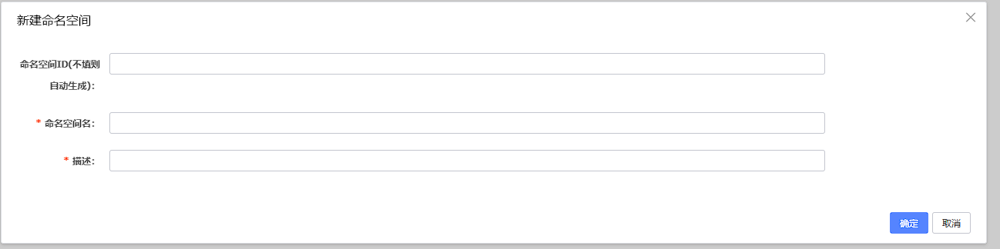


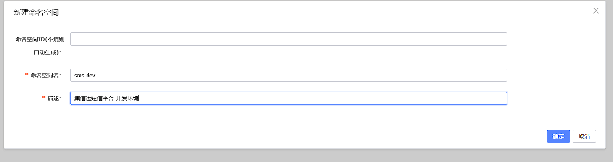


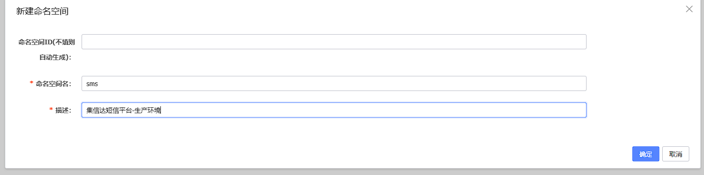


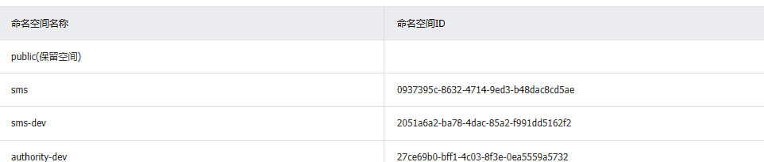


### 配置文件

#### common.yml

```yaml
server:
  undertow: # jetty  undertow
    io-threads: 8 # 设置IO线程数, 它主要执行非阻塞的任务,它们会负责多个连接, 默认设置每个CPU核心一个线程
    worker-threads: 120  # 阻塞任务线程池, 当执行类似servlet请求阻塞操作, undertow会从这个线程池中取得线程,它的值设置取决于系统的负载
    buffer-size: 2048  # 以下的配置会影响buffer,这些buffer会用于服务器连接的IO操作,有点类似netty的池化内存管理 , 每块buffer的空间大小,越小的空间被利用越充分
    direct-buffers: true  # 是否分配的直接内存

spring:
  http:
    encoding:
      charset: UTF-8
      force: true
      enabled: true
  servlet:
    multipart:
      max-file-size: 512MB      # Max file size，默认1M
      max-request-size: 512MB   # Max request size，默认10M

dozer:
  mappingFiles:
    - classpath:dozer/global.dozer.xml
    - classpath:dozer/biz.dozer.xml
management:
  endpoints:
    web:
      base-path: /actuator
      exposure:
        include: '*'
  endpoint:
    health:
      show-details: ALWAYS
      enabled: true

feign:
  httpclient:
    enabled: false
  okhttp:
    enabled: true
  hystrix:
    enabled: true   # feign 熔断机制是否开启
    #支持压缩的mime types
  compression:  # 请求压缩
    request:
      enabled: true
      mime-types: text/xml,application/xml,application/json
      min-request-size: 2048
    response:  # 响应压缩
      enabled: true

ribbon:
  httpclient:
    enabled: false
  okhttp:
    enabled: true
  eureka:
    enabled: true
  ReadTimeout: 30000     #
  ConnectTimeout: 30000  # [ribbon超时时间]大于[熔断超时],那么会先走熔断，相当于你配的ribbon超时就不生效了  ribbon和hystrix是同时生效的，哪个值小哪个生效
  MaxAutoRetries: 0             # 最大自动重试
  MaxAutoRetriesNextServer: 1   # 最大自动像下一个服务重试
  OkToRetryOnAllOperations: false  #无论是请求超时或者socket read timeout都进行重试，

hystrix:
  threadpool:
    default:
      coreSize: 1000 # #并发执行的最大线程数，默认10
      maxQueueSize: 1000 # #BlockingQueue的最大队列数
      queueSizeRejectionThreshold: 500 # #即使maxQueueSize没有达到，达到queueSizeRejectionThreshold该值后，请求也会被拒绝
  command:
    default
      execution:
        isolation:
          thread:
            timeoutInMilliseconds: 120000  # 熔断超时 ribbon和hystrix是同时生效的，哪个值小哪个生效

id-generator:
  machine-code: 1  # id生成器机器掩码
```


#### mysql.yml

```yaml
# mysql 个性化配置， 不同的环境，需要配置不同的链接信息，只需要将这段信息复制
# 到具体环境的配置文件中进行修改即可
# 如：复制到auth-server-dev.yml中将数据库名和ip改掉

mysql:
  ip: 127.0.0.1
  port: 3306
  driverClassName: com.mysql.cj.jdbc.Driver
  database: authority
  username: root
  password: 20010713
database:
  isBlockAttack: false  # 是否启用 攻击 SQL 阻断解析器


# mysql 通用配置
spring:
  datasource:
    druid:
      username: ${mysql.username}
      password: ${mysql.password}
      driver-class-name: ${mysql.driverClassName}
      url: jdbc:mysql://${mysql.ip}:${mysql.port}/${mysql.database}?serverTimezone=GMT&characterEncoding=utf8
      # &useUnicode=true&useSSL=false&autoReconnect=true&zeroDateTimeBehavior=convertToNull&allowMultiQueries=true
      db-type: mysql
      initialSize: 10
      minIdle: 10
      maxActive: 500
      max-wait: 60000
      pool-prepared-statements: true
      max-pool-prepared-statement-per-connection-size: 20
      validation-query: SELECT 'x'
      test-on-borrow: false
      test-on-return: false
      test-while-idle: true
      time-between-eviction-runs-millis: 60000  #配置间隔多久才进行一次检测，检测需要关闭的空闲连接，单位是毫秒
      min-evictable-idle-time-millis: 300000    #配置一个连接在池中最小生存的时间，单位是毫秒
      filters: stat,wall
      filter:
        wall:
          enabled: true
          config:
            commentAllow: true
            multiStatementAllow: true
            noneBaseStatementAllow: true
      web-stat-filter:  # WebStatFilter配置，说明请参考Druid Wiki，配置_配置WebStatFilter
        enabled: true
        url-pattern: /*
        exclusions: "*.js , *.gif ,*.jpg ,*.png ,*.css ,*.ico , /druid/*"
        session-stat-max-count: 1000
        profile-enable: true
        session-stat-enable: false
      stat-view-servlet:  #展示Druid的统计信息,StatViewServlet的用途包括：1.提供监控信息展示的html页面 2.提供监控信息的JSON API
        enabled: true
        url-pattern: /druid/*   #根据配置中的url-pattern来访问内置监控页面，如果是上面的配置，内置监控页面的首页是/druid/index.html例如：http://127.0.0.1:9000/druid/index.html
        reset-enable: true    #允许清空统计数据
        login-username: root
        login-password: 123456

mybatis-plus:
  mapper-locations:
    - classpath*:mapper_**/**/*Mapper.xml
  #实体扫描，多个package用逗号或者分号分隔
  typeAliasesPackage: mao
  global-config:
    db-config:
      id-type: INPUT
      insert-strategy: NOT_NULL
      update-strategy: NOT_NULL
      select-strategy: NOT_EMPTY
  configuration:
    #配置返回数据库(column下划线命名&&返回java实体是驼峰命名)，
    #自动匹配无需as（没开启这个，SQL需要写as： select user_id as userId）
    map-underscore-to-camel-case: true
    cache-enabled: false
    #配置JdbcTypeForNull, oracle数据库必须配置
    jdbc-type-for-null: 'null'

```


#### redis.yml

```yaml
# redis 通用配置， 不同的环境，需要配置不同的链接信息，
# 只需要将这段信息复制到具体环境的配置文件中进行修改即可
# 如：复制到auth-server-dev.yml中将数据库名和ip改掉

redis:
  hosts: 127.0.0.1:6379
  password: 123456
  database: 0

spring:
  cache:
    type: GENERIC
  redis:
    hosts: ${redis.hosts}
    password: ${redis.password}
    database: ${redis.database}

j2cache:
  #  config-location: /j2cache.properties
  open-spring-cache: true
  cache-clean-mode: passive
  allow-null-values: true
  redis-client: lettuce
  l2-cache-open: true
  # l2-cache-open: false     # 关闭二级缓存
  broadcast: net.oschina.j2cache.cache.support.redis.SpringRedisPubSubPolicy
  #  broadcast: jgroups       # 关闭二级缓存
  L1:
    provider_class: caffeine
  L2:
    provider_class: net.oschina.j2cache.cache.support.redis.SpringRedisProvider
    config_section: lettuce
  sync_ttl_to_redis: true
  default_cache_null_object: false
  serialization: fst
caffeine:
  properties: /j2cache/caffeine.properties   # 这个配置文件需要放在项目中
lettuce:
  mode: single
  namespace:
  storage: generic
  channel: j2cache
  scheme: redis
  hosts: ${redis.hosts}
  password: ${redis.password}
  database: ${redis.database}
  sentinelMasterId:
  maxTotal: 100
  maxIdle: 10
  minIdle: 10
  timeout: 10000
```


#### sms-api.yml

```yaml
# 在这里配置 权限服务 所有环境都能使用的配置
def:
  mysql:
    database: sms
  swagger:
    enabled: true
    docket:
      sms:
        title: 短信接收服务
        base-package: mao.sms.controller

authentication:
  user:
    header-name: token
    expire: 43200               # 外部token有效期为12小时
    pri-key: client/pri.key    # 加密
    pub-key: client/pub.key    # 解密


spring:
  cache:
    type: REDIS
  redis:
    database: 1 # Redis数据库索引（默认为0）
    #host: 192.168.0.201 # Redis服务器地址
    #port: 7001 # Redis服务器连接端口
    password: 123456 #czbk@redis@123456
    timeout: 10000ms # 连接超时时间（毫秒）默认是2000ms
    lettuce:
      pool:
        max-active: 200 # 连接池最大连接数（使用负值表示没有限制）
        max-idle: 20 # 连接池中的最大空闲连接
        min-idle: 0 # 连接池中的最小空闲连接
        max-wait: -1ms # 连接池最大阻塞等待时间（使用负值表示没有限制）
    sentinel:
      master: mymaster
      nodes: #哨兵地址列表，多个以,分割
        - 52.83.92.196:26380
        - 52.83.92.196:26381
        - 52.83.92.196:26382 
```


#### sms-manage.yml

```yaml
# 在这里配置 权限服务 所有环境都能使用的配置
def:
  mysql:
    database: sms
  swagger:
    enabled: true
    docket:
      sms:
        title: 短信平台管理
        base-package: mao.sms.controller

authentication:
  user:
    header-name: token
    expire: 43200               # 外部token有效期为12小时
    pri-key: client/pri.key    # 加密
    pub-key: client/pub.key    # 解密


spring:
  cache:
    type: REDIS
  redis:
    database: 1 # Redis数据库索引（默认为0）
    #host: 192.168.0.201 # Redis服务器地址
    #port: 7001 # Redis服务器连接端口
    password: 123456 #czbk@redis@123456
    timeout: 10000ms # 连接超时时间（毫秒）默认是2000ms
    lettuce:
      pool:
        max-active: 200 # 连接池最大连接数（使用负值表示没有限制）
        max-idle: 20 # 连接池中的最大空闲连接
        min-idle: 3 # 连接池中的最小空闲连接
        max-wait: -1ms # 连接池最大阻塞等待时间（使用负值表示没有限制）
    sentinel:
      master: mymaster
      nodes: #哨兵地址列表，多个以,分割
        - 52.83.92.196:26380
        - 52.83.92.196:26381
        - 52.83.92.196:26382 
    queue:
      pop:
        timeout: 8000 #消息队列等待时间 不能超过链接的超时时间

# 服务端使用sdk配置信息
def:
  sms:
    auth: false
    domain: http://localhost:8771
    accessKeyId: 7fea0419ea7c435887f996cfecda5a3a
    accessKeySecret: 842ce103df7b4117bb47c888cc528516
```


#### pd-sms-server.yml

```yaml
# 在这里配置 权限服务 所有环境都能使用的配置
def:
  mysql:
    database: sms
  swagger:
    enabled: true
    docket:
      sms:
        title: 短信发送服务
        base-package: mao.sms.controller
  sms: 
    messageErrorNum: 3
    configLevelFailNum: 10
    configBuildScale: 0.75
    
authentication:
  user:
    header-name: token
    expire: 43200               # 外部token有效期为12小时
    pri-key: client/pri.key    # 加密
    pub-key: client/pub.key    # 解密
server:
  port: 8772

spring:
  cache:
    type: REDIS
  redis:
    database: 1 # Redis数据库索引（默认为0）
    #host: 192.168.0.201 # Redis服务器地址
    #port: 7001 # Redis服务器连接端口
    password: 123456 #czbk@redis@123456
    timeout: 10000ms # 连接超时时间（毫秒）默认是2000ms
    lettuce:
      pool:
        max-active: 200 # 连接池最大连接数（使用负值表示没有限制）
        max-idle: 20 # 连接池中的最大空闲连接
        min-idle: 3 # 连接池中的最小空闲连接
        max-wait: -1ms # 连接池最大阻塞等待时间（使用负值表示没有限制）
    sentinel:
      master: mymaster
      nodes: #哨兵地址列表，多个以,分割
        - 52.83.92.196:26380
        - 52.83.92.196:26381
        - 52.83.92.196:26382 
    queue:
      pop:
        timeout: 8000 #消息队列等待时间 不能超过链接的超时时间
```


## 后端工程

### 脚手架

https://github.com/maomao124/authority


```sh
authority                    #聚合工程，用于聚合parent、apps、tools等模块
├── parent				     # 父工程，nacos配置及依赖包管理
├── apps					 # 应用目录
	├── auth				 # 权限服务父工程
		├── auth-entity      # 权限实体
		├── auth-server      # 权限服务
	├── gateway			     # 网关服务
└── tools				     # 工具工程
	├── tools-common		 # 基础组件：基础配置类、函数、常量、统一异常处理、undertow服务器
	├── tools-core		     # 核心组件：基础实体、返回对象、上下文、异常处理、分布式锁、函数、树
	├── tools-databases	     # 数据源组件：数据源配置、数据权限、查询条件等
	├── tools-dozer		     # 对象转换：dozer配置、工具
	├── tools-j2cache	     # 缓存组件：j2cache、redis缓存
	├── tools-jwt            # JWT组件：配置、属性、工具
	├── tools-log	         # 日志组件：日志实体、事件、拦截器、工具
	├── tools-swagger2	     # 文档组件：knife4j文档
	├── tools-user           # 用户上下文：用户注解、模型和工具，当前登录用户信息注入模块
	├── tools-validator	     # 表单验证： 后台表单规则验证
	├── tools-xss		     # xss防注入组件
```


不项目只需要使用到脚手架的部分tools模块为父模块的子模块，其它的暂时都不需要


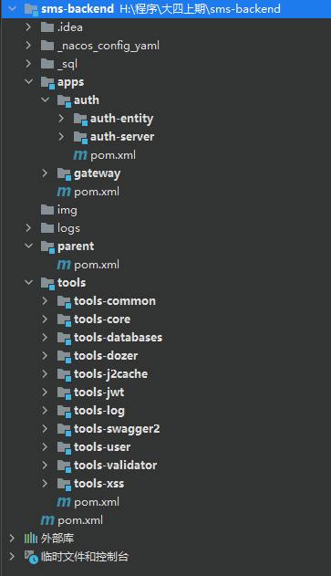


### 初始化工程

在apps目录下创建一个名字为sms的子工程


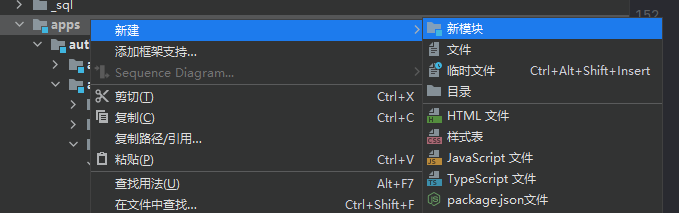


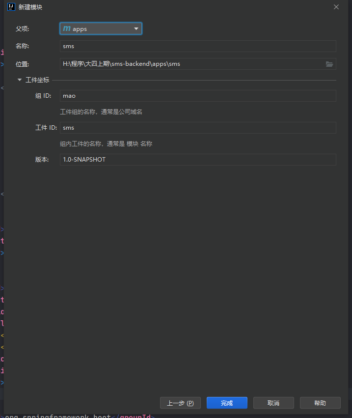


创建sms项目的子项目sms-entity


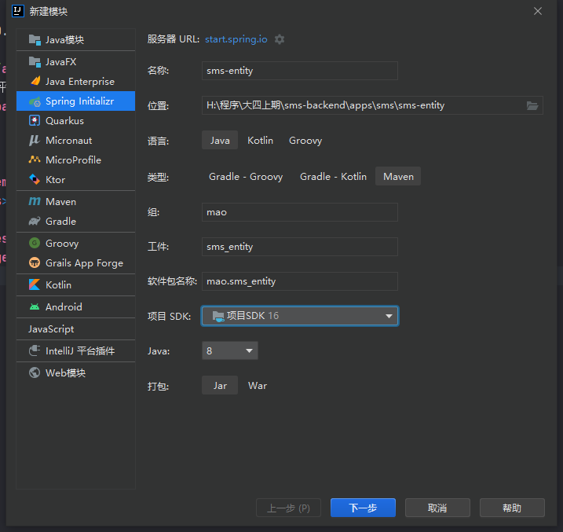


创建sms项目的子项目sms-manage


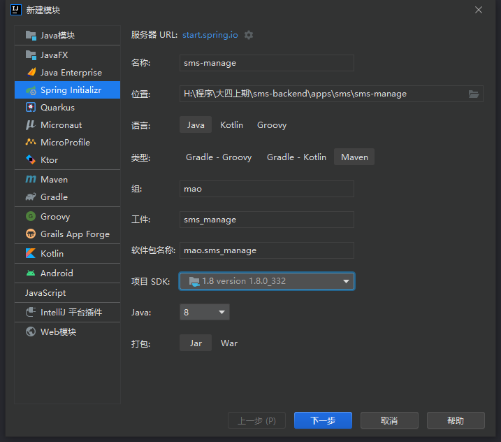


创建sms项目的子项目sms-api


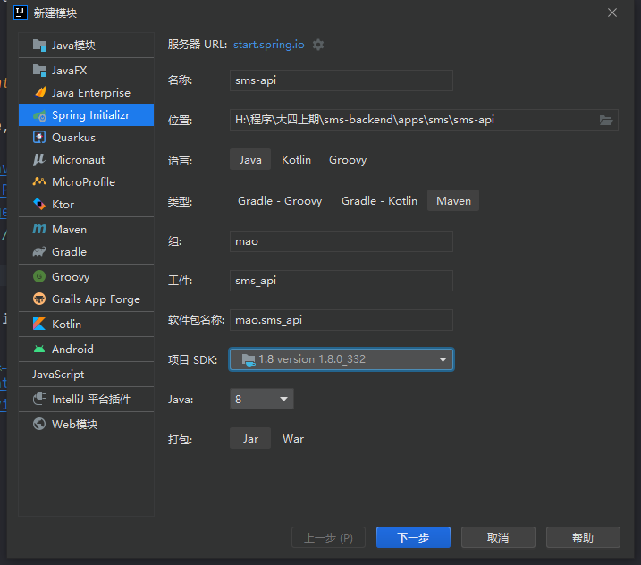


创建sms项目的子项目sms-server


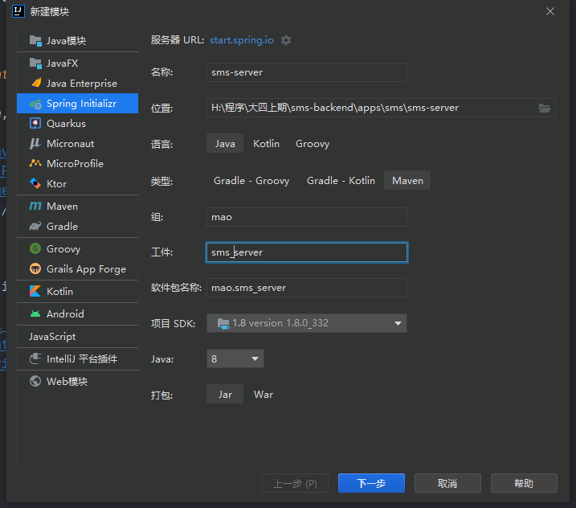


创建sms项目的子项目sms-sdk


最后的项目结构如下


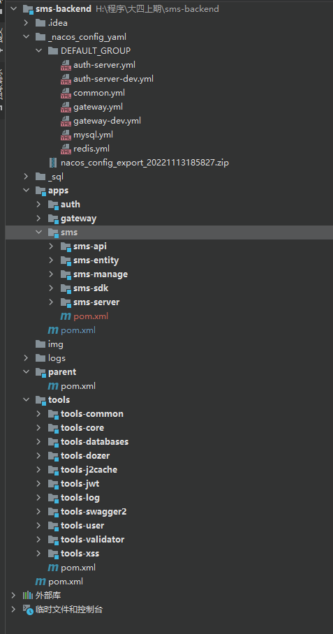


### 更改pom文件


