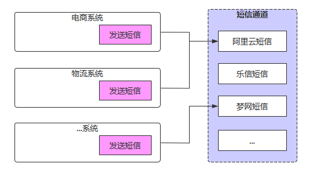
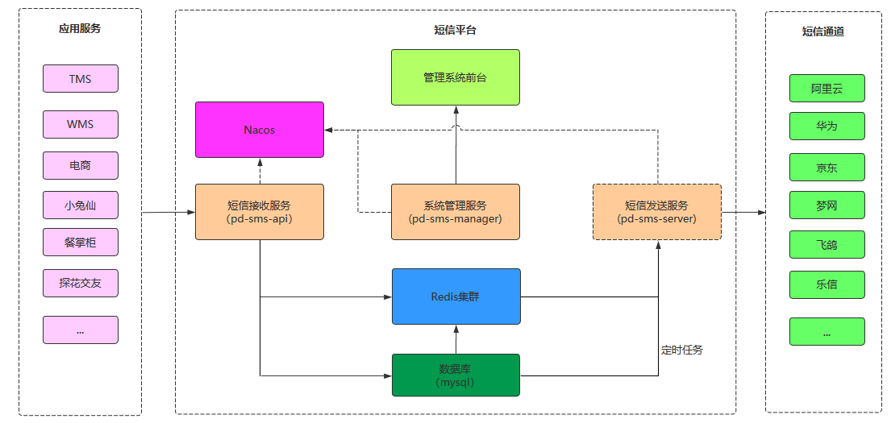
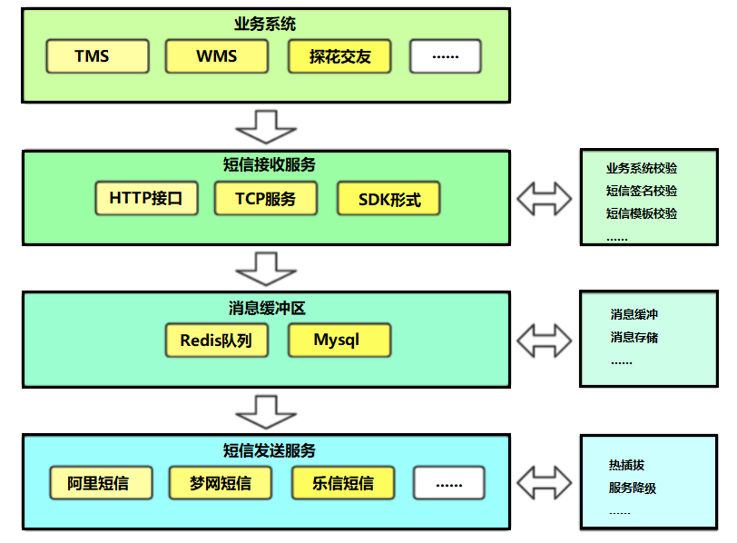

# 项目概述

## 背景介绍

随着企业业务扩张、应用成倍的增加、短信规模化使用，传统短信平台的接入方式和单一的信息发送功能，已经不能完全满足现代企业管理的需求，所以统一入口、减少对接成本、同时兼顾多种短信业务、简单易行的操作与维护、高稳定、高可靠的移动信息化应用成为短信平台发展趋势。  





- 服务越来越多，每个服务都有可能发送短信，是否每个服务都需要对接一遍？
- 多应用对接短信，如何做到短信发送服务高效、稳定？
- 短信通道出现异常时，如何快速切换通道？
- 切换通道时，如何做到应用服务无感知？
- 如何统计各服务短信发送情况，以便进行后续营销分析？


本项目的核心在于保证短信高效、准确的送达、简单易操作的对接方式。通过对服务的解耦、通讯方式的升级来提升系统的吞吐量。同时在多通道的加持下，通过智能动态的通道评级、选举、降级、热插拔，增强了系统的健壮性，摆脱对单一通道的依赖。并且提供多种对接方式，满足企业内部的各种需求。


## 整体架构




## 业务架构




## 项目模块介绍

项目整体工程结构和模块功能如下：

```sh
pd-sms          			 # 集信达 短信平台父工程
	├──sms-entity		     # 短信平台实体
	├──sms-manage		     # 系统管理服务
	├──sms-api			     # 短信接收服务，应用系统调用接口、发送短信
	├──sms-server		     # 短信发送服务，调用短信通道、发送短信
	└──sms-sdk			     # 短信SDK，应用系统引入、发送短信
```


集信达短信服务有三个：后台管理服务，短信接收服务，短信发送服务：

|     应用      | 端口 |     说明     |
| :-----------: | :--: | :----------: |
| pd-sms-manage | 8770 | 后台管理服务 |
|  pd-sms-api   | 8771 | 短信接收服务 |
| pd-sms-server | 8772 | 短信发送服务 |


# 项目环境准备

## 数据库

```sql
SET NAMES utf8mb4;
SET FOREIGN_KEY_CHECKS = 0;

-- ----------------------------
-- Table structure for black_list
-- ----------------------------
DROP TABLE IF EXISTS `black_list`;
CREATE TABLE `black_list`
(
    `id`          varchar(64) CHARACTER SET utf8mb4 COLLATE utf8mb4_bin  NOT NULL COMMENT '主键',
    `type`        varchar(10) CHARACTER SET utf8mb4 COLLATE utf8mb4_bin  NOT NULL COMMENT '类型：1：短信、2：邮件、3：微信',
    `content`     varchar(64) CHARACTER SET utf8mb4 COLLATE utf8mb4_bin  NOT NULL COMMENT '内容：手机号',
    `remark`      varchar(200) CHARACTER SET utf8mb4 COLLATE utf8mb4_bin NULL     DEFAULT NULL COMMENT '备注',
    `create_time` datetime(0)                                            NOT NULL DEFAULT CURRENT_TIMESTAMP COMMENT '创建时间',
    `create_user` varchar(64) CHARACTER SET utf8mb4 COLLATE utf8mb4_bin  NOT NULL COMMENT '创建人',
    `update_time` datetime(0)                                            NOT NULL DEFAULT CURRENT_TIMESTAMP ON UPDATE CURRENT_TIMESTAMP(0) COMMENT '修改时间',
    `update_user` varchar(64) CHARACTER SET utf8mb4 COLLATE utf8mb4_bin  NULL     DEFAULT NULL COMMENT '修改人',
    `is_delete`   tinyint(0)                                             NOT NULL DEFAULT 1 COMMENT '逻辑删除：0删除',
    PRIMARY KEY (`id`) USING BTREE,
    UNIQUE INDEX `black_list_content_type` (`type`, `content`) USING BTREE
) ENGINE = InnoDB
  CHARACTER SET = utf8mb4
  COLLATE = utf8mb4_bin COMMENT = '黑名单'
  ROW_FORMAT = Dynamic;

-- ----------------------------
-- Table structure for config
-- ----------------------------
DROP TABLE IF EXISTS `config`;
CREATE TABLE `config`
(
    `id`                varchar(64) CHARACTER SET utf8mb4 COLLATE utf8mb4_bin  NOT NULL COMMENT '主键',
    `name`              varchar(100) CHARACTER SET utf8mb4 COLLATE utf8mb4_bin NOT NULL COMMENT '名称',
    `platform`          varchar(20) CHARACTER SET utf8mb4 COLLATE utf8mb4_bin  NOT NULL COMMENT '平台',
    `domain`            varchar(100) CHARACTER SET utf8mb4 COLLATE utf8mb4_bin NOT NULL COMMENT '域名',
    `access_key_id`     varchar(100) CHARACTER SET utf8mb4 COLLATE utf8mb4_bin NULL     DEFAULT NULL,
    `access_key_secret` varchar(100) CHARACTER SET utf8mb4 COLLATE utf8mb4_bin NULL     DEFAULT NULL,
    `other`             json                                                   NULL COMMENT '其他配置 json格式',
    `is_active`         tinyint(0)                                             NOT NULL COMMENT '是否可用：0不可用',
    `is_enable`         tinyint(0)                                             NOT NULL COMMENT '是否正常：0不正常',
    `remark`            varchar(500) CHARACTER SET utf8mb4 COLLATE utf8mb4_bin NULL     DEFAULT NULL COMMENT '备注',
    `level`             tinyint(0)                                             NULL     DEFAULT NULL COMMENT '级别',
    `channel_type`      tinyint(0)                                             NOT NULL COMMENT '通道类型，1：文字，2：语音，3：推送',
    `create_time`       datetime(0)                                            NOT NULL DEFAULT CURRENT_TIMESTAMP COMMENT '创建时间',
    `create_user`       varchar(64) CHARACTER SET utf8mb4 COLLATE utf8mb4_bin  NOT NULL COMMENT '创建人',
    `update_time`       datetime(0)                                            NOT NULL DEFAULT CURRENT_TIMESTAMP ON UPDATE CURRENT_TIMESTAMP(0) COMMENT '修改时间',
    `update_user`       varchar(64) CHARACTER SET utf8mb4 COLLATE utf8mb4_bin  NULL     DEFAULT NULL COMMENT '修改人',
    `is_delete`         tinyint(0)                                             NOT NULL DEFAULT 1 COMMENT '逻辑删除：0删除',
    PRIMARY KEY (`id`) USING BTREE,
    UNIQUE INDEX `config_name` (`name`) USING BTREE
) ENGINE = InnoDB
  CHARACTER SET = utf8mb4
  COLLATE = utf8mb4_bin COMMENT = '配置表'
  ROW_FORMAT = Dynamic;

-- ----------------------------
-- Table structure for config_signature
-- ----------------------------
DROP TABLE IF EXISTS `config_signature`;
CREATE TABLE `config_signature`
(
    `id`                    varchar(64) CHARACTER SET utf8mb4 COLLATE utf8mb4_bin  NOT NULL COMMENT '主键',
    `config_id`             varchar(64) CHARACTER SET utf8mb4 COLLATE utf8mb4_bin  NOT NULL COMMENT '配置主键',
    `signature_id`          varchar(64) CHARACTER SET utf8mb4 COLLATE utf8mb4_bin  NOT NULL COMMENT '签名主键',
    `config_signature_code` varchar(64) CHARACTER SET utf8mb4 COLLATE utf8mb4_bin  NULL     DEFAULT NULL COMMENT '通道签名（如果为空在不需要签名id）',
    `remark`                varchar(255) CHARACTER SET utf8mb4 COLLATE utf8mb4_bin NULL     DEFAULT NULL COMMENT '备注',
    `create_time`           datetime(0)                                            NOT NULL DEFAULT CURRENT_TIMESTAMP COMMENT '创建时间',
    `create_user`           varchar(64) CHARACTER SET utf8mb4 COLLATE utf8mb4_bin  NOT NULL COMMENT '创建人',
    `update_time`           datetime(0)                                            NOT NULL DEFAULT CURRENT_TIMESTAMP ON UPDATE CURRENT_TIMESTAMP(0) COMMENT '修改时间',
    `update_user`           varchar(64) CHARACTER SET utf8mb4 COLLATE utf8mb4_bin  NULL     DEFAULT NULL COMMENT '修改人',
    `is_delete`             tinyint(0)                                             NOT NULL DEFAULT 1 COMMENT '逻辑删除：0删除',
    PRIMARY KEY (`id`) USING BTREE
) ENGINE = InnoDB
  CHARACTER SET = utf8mb4
  COLLATE = utf8mb4_bin COMMENT = '配置—签名表'
  ROW_FORMAT = Dynamic;
-- ----------------------------
-- Table structure for config_template
-- ----------------------------
DROP TABLE IF EXISTS `config_template`;
CREATE TABLE `config_template`
(
    `id`                   varchar(64) CHARACTER SET utf8mb4 COLLATE utf8mb4_bin  NOT NULL COMMENT '主键',
    `config_id`            varchar(64) CHARACTER SET utf8mb4 COLLATE utf8mb4_bin  NOT NULL COMMENT '配置主键',
    `template_id`          varchar(64) CHARACTER SET utf8mb4 COLLATE utf8mb4_bin  NOT NULL COMMENT '模板主键',
    `config_template_code` varchar(64) CHARACTER SET utf8mb4 COLLATE utf8mb4_bin  NULL     DEFAULT NULL COMMENT '通道模板（如果为空在不需要模板id）',
    `remark`               varchar(255) CHARACTER SET utf8mb4 COLLATE utf8mb4_bin NULL     DEFAULT NULL COMMENT '备注',
    `create_time`          datetime(0)                                            NOT NULL DEFAULT CURRENT_TIMESTAMP COMMENT '创建时间',
    `create_user`          varchar(64) CHARACTER SET utf8mb4 COLLATE utf8mb4_bin  NOT NULL COMMENT '创建人',
    `update_time`          datetime(0)                                            NOT NULL DEFAULT CURRENT_TIMESTAMP ON UPDATE CURRENT_TIMESTAMP(0) COMMENT '修改时间',
    `update_user`          varchar(64) CHARACTER SET utf8mb4 COLLATE utf8mb4_bin  NULL     DEFAULT NULL COMMENT '修改人',
    `is_delete`            tinyint(0)                                             NOT NULL DEFAULT 1 COMMENT '逻辑删除：0删除',
    PRIMARY KEY (`id`) USING BTREE
) ENGINE = InnoDB
  CHARACTER SET = utf8mb4
  COLLATE = utf8mb4_bin COMMENT = '配置—模板表'
  ROW_FORMAT = Dynamic;

-- ----------------------------
-- Table structure for manual_process
-- ----------------------------
DROP TABLE IF EXISTS `manual_process`;
CREATE TABLE `manual_process`
(
    `id`          varchar(64) CHARACTER SET utf8mb4 COLLATE utf8mb4_bin   NOT NULL COMMENT '主键',
    `template`    varchar(64) CHARACTER SET utf8mb4 COLLATE utf8mb4_bin   NULL     DEFAULT NULL COMMENT '模板',
    `signature`   varchar(64) CHARACTER SET utf8mb4 COLLATE utf8mb4_bin   NULL     DEFAULT NULL COMMENT '签名',
    `mobile`      varchar(20) CHARACTER SET utf8mb4 COLLATE utf8mb4_bin   NOT NULL COMMENT '手机号',
    `request`     varchar(5000) CHARACTER SET utf8mb4 COLLATE utf8mb4_bin NULL     DEFAULT NULL COMMENT '请求参数',
    `config_ids`  varchar(500) CHARACTER SET utf8mb4 COLLATE utf8mb4_bin  NULL     DEFAULT NULL COMMENT '通道id集合',
    `status`      tinyint(0)                                              NOT NULL DEFAULT 0 COMMENT '状态 0新建，1处理中，2处理成功，3处理失败',
    `remark`      varchar(255) CHARACTER SET utf8mb4 COLLATE utf8mb4_bin  NULL     DEFAULT NULL COMMENT '备注',
    `create_time` datetime(0)                                             NOT NULL DEFAULT CURRENT_TIMESTAMP COMMENT '创建时间',
    `create_user` varchar(64) CHARACTER SET utf8mb4 COLLATE utf8mb4_bin   NULL     DEFAULT NULL COMMENT '创建人',
    `update_time` datetime(0)                                             NOT NULL DEFAULT CURRENT_TIMESTAMP ON UPDATE CURRENT_TIMESTAMP(0) COMMENT '修改时间',
    `update_user` varchar(64) CHARACTER SET utf8mb4 COLLATE utf8mb4_bin   NULL     DEFAULT NULL COMMENT '修改人',
    `is_delete`   tinyint(0)                                              NOT NULL DEFAULT 1 COMMENT '逻辑删除：0删除',
    PRIMARY KEY (`id`) USING BTREE
) ENGINE = InnoDB
  CHARACTER SET = utf8mb4
  COLLATE = utf8mb4_bin COMMENT = '人工处理任务表'
  ROW_FORMAT = Dynamic;

-- ----------------------------
-- Table structure for platform
-- ----------------------------
DROP TABLE IF EXISTS `platform`;
CREATE TABLE `platform`
(
    `id`                varchar(64) CHARACTER SET utf8mb4 COLLATE utf8mb4_bin  NOT NULL COMMENT '主键',
    `name`              varchar(20) CHARACTER SET utf8mb4 COLLATE utf8mb4_bin  NOT NULL COMMENT '平台名称',
    `access_key_id`     varchar(100) CHARACTER SET utf8mb4 COLLATE utf8mb4_bin NULL     DEFAULT NULL,
    `access_key_secret` varchar(100) CHARACTER SET utf8mb4 COLLATE utf8mb4_bin NULL     DEFAULT NULL,
    `ip_addr`           varchar(100) CHARACTER SET utf8mb4 COLLATE utf8mb4_bin NULL     DEFAULT NULL COMMENT 'ip绑定,多个用英文逗号分隔',
    `need_auth`         tinyint(0)                                             NOT NULL DEFAULT 0 COMMENT '是否鉴权：0不鉴权',
    `is_active`         tinyint(0)                                             NOT NULL DEFAULT 1 COMMENT '是否可用：0不可用',
    `remark`            varchar(500) CHARACTER SET utf8mb4 COLLATE utf8mb4_bin NULL     DEFAULT NULL COMMENT '备注',
    `level`             tinyint(0)                                             NULL     DEFAULT NULL COMMENT '平台等级（预留）',
    `create_time`       datetime(0)                                            NOT NULL DEFAULT CURRENT_TIMESTAMP COMMENT '创建时间',
    `create_user`       varchar(64) CHARACTER SET utf8mb4 COLLATE utf8mb4_bin  NOT NULL COMMENT '创建人',
    `update_time`       datetime(0)                                            NOT NULL DEFAULT CURRENT_TIMESTAMP ON UPDATE CURRENT_TIMESTAMP(0) COMMENT '修改时间',
    `update_user`       varchar(64) CHARACTER SET utf8mb4 COLLATE utf8mb4_bin  NULL     DEFAULT NULL COMMENT '修改人',
    `is_delete`         tinyint(0)                                             NOT NULL DEFAULT 1 COMMENT '逻辑删除：0删除',
    PRIMARY KEY (`id`) USING BTREE,
    UNIQUE INDEX `platform_name` (`name`) USING BTREE
) ENGINE = InnoDB
  CHARACTER SET = utf8mb4
  COLLATE = utf8mb4_bin COMMENT = '接入平台表'
  ROW_FORMAT = Dynamic;

-- ----------------------------
-- Table structure for signature
-- ----------------------------
DROP TABLE IF EXISTS `signature`;
CREATE TABLE `signature`
(
    `id`          varchar(64) CHARACTER SET utf8mb4 COLLATE utf8mb4_bin  NOT NULL COMMENT '主键',
    `name`        varchar(64) CHARACTER SET utf8mb4 COLLATE utf8mb4_bin  NOT NULL COMMENT '签名名称',
    `code`        varchar(64) CHARACTER SET utf8mb4 COLLATE utf8mb4_bin  NOT NULL COMMENT '签名编码',
    `content`     varchar(64) CHARACTER SET utf8mb4 COLLATE utf8mb4_bin  NOT NULL COMMENT '签名内容',
    `remark`      varchar(255) CHARACTER SET utf8mb4 COLLATE utf8mb4_bin NULL     DEFAULT NULL COMMENT '备注',
    `create_time` datetime(0)                                            NOT NULL DEFAULT CURRENT_TIMESTAMP COMMENT '创建时间',
    `create_user` varchar(64) CHARACTER SET utf8mb4 COLLATE utf8mb4_bin  NOT NULL COMMENT '创建人',
    `update_time` datetime(0)                                            NOT NULL DEFAULT CURRENT_TIMESTAMP ON UPDATE CURRENT_TIMESTAMP(0) COMMENT '修改时间',
    `update_user` varchar(64) CHARACTER SET utf8mb4 COLLATE utf8mb4_bin  NULL     DEFAULT NULL COMMENT '修改人',
    `is_delete`   tinyint(0)                                             NOT NULL DEFAULT 1 COMMENT '逻辑删除：0删除',
    PRIMARY KEY (`id`) USING BTREE,
    UNIQUE INDEX `signature_code` (`code`) USING BTREE,
    UNIQUE INDEX `signature_name` (`name`) USING BTREE
) ENGINE = InnoDB
  CHARACTER SET = utf8mb4
  COLLATE = utf8mb4_bin COMMENT = '签名表'
  ROW_FORMAT = Dynamic;

-- ----------------------------
-- Table structure for template
-- ----------------------------
DROP TABLE IF EXISTS `template`;
CREATE TABLE `template`
(
    `id`          varchar(64) CHARACTER SET utf8mb4 COLLATE utf8mb4_bin  NOT NULL COMMENT '主键',
    `name`        varchar(64) CHARACTER SET utf8mb4 COLLATE utf8mb4_bin  NOT NULL COMMENT '模板名称',
    `code`        varchar(64) CHARACTER SET utf8mb4 COLLATE utf8mb4_bin  NOT NULL COMMENT '模板编码',
    `content`     varchar(500) CHARACTER SET utf8mb4 COLLATE utf8mb4_bin NOT NULL COMMENT '模板内容',
    `type`        tinyint(0)                                             NULL     DEFAULT NULL COMMENT '模板类型 1：验证码，2：营销类',
    `remark`      varchar(255) CHARACTER SET utf8mb4 COLLATE utf8mb4_bin NULL     DEFAULT NULL COMMENT '备注',
    `create_time` datetime(0)                                            NOT NULL DEFAULT CURRENT_TIMESTAMP COMMENT '创建时间',
    `create_user` varchar(64) CHARACTER SET utf8mb4 COLLATE utf8mb4_bin  NOT NULL COMMENT '创建人',
    `update_time` datetime(0)                                            NOT NULL DEFAULT CURRENT_TIMESTAMP ON UPDATE CURRENT_TIMESTAMP(0) COMMENT '修改时间',
    `update_user` varchar(64) CHARACTER SET utf8mb4 COLLATE utf8mb4_bin  NULL     DEFAULT NULL COMMENT '修改人',
    `is_delete`   tinyint(0)                                             NOT NULL DEFAULT 1 COMMENT '逻辑删除：0删除',
    PRIMARY KEY (`id`) USING BTREE,
    UNIQUE INDEX `template_code` (`code`) USING BTREE,
    UNIQUE INDEX `template_name` (`name`) USING BTREE
) ENGINE = InnoDB
  CHARACTER SET = utf8mb4
  COLLATE = utf8mb4_bin COMMENT = '模板表'
  ROW_FORMAT = Dynamic;

-- ----------------------------
-- Table structure for timing_push
-- ----------------------------
DROP TABLE IF EXISTS `timing_push`;
CREATE TABLE `timing_push`
(
    `id`          varchar(64) CHARACTER SET utf8mb4 COLLATE utf8mb4_bin   NOT NULL COMMENT '主键',
    `template`    varchar(64) CHARACTER SET utf8mb4 COLLATE utf8mb4_bin   NOT NULL COMMENT '模板',
    `signature`   varchar(64) CHARACTER SET utf8mb4 COLLATE utf8mb4_bin   NOT NULL COMMENT '签名',
    `mobile`      varchar(20) CHARACTER SET utf8mb4 COLLATE utf8mb4_bin   NOT NULL COMMENT '手机号',
    `request`     varchar(5000) CHARACTER SET utf8mb4 COLLATE utf8mb4_bin NOT NULL COMMENT '参数json',
    `timing`      varchar(40) CHARACTER SET utf8mb4 COLLATE utf8mb4_bin   NULL     DEFAULT NULL COMMENT '发送时间',
    `status`      tinyint(0)                                              NOT NULL DEFAULT 0 COMMENT '状态 0：未处理 1：已处理',
    `remark`      varchar(255) CHARACTER SET utf8mb4 COLLATE utf8mb4_bin  NULL     DEFAULT NULL COMMENT '备注',
    `create_time` datetime(0)                                             NOT NULL DEFAULT CURRENT_TIMESTAMP COMMENT '创建时间',
    `create_user` varchar(64) CHARACTER SET utf8mb4 COLLATE utf8mb4_bin   NULL     DEFAULT NULL COMMENT '创建人',
    `update_time` datetime(0)                                             NOT NULL DEFAULT CURRENT_TIMESTAMP ON UPDATE CURRENT_TIMESTAMP(0) COMMENT '修改时间',
    `update_user` varchar(64) CHARACTER SET utf8mb4 COLLATE utf8mb4_bin   NULL     DEFAULT NULL COMMENT '修改人',
    `is_delete`   tinyint(0)                                              NOT NULL DEFAULT 1 COMMENT '逻辑删除：0删除',
    PRIMARY KEY (`id`) USING BTREE,
    INDEX `timing_push_status` (`status`) USING BTREE
) ENGINE = InnoDB
  CHARACTER SET = utf8mb4
  COLLATE = utf8mb4_bin COMMENT = '定时发送'
  ROW_FORMAT = Dynamic;


-- ----------------------------
-- Table structure for receive_log
-- ----------------------------
DROP TABLE IF EXISTS `receive_log`;
CREATE TABLE `receive_log`
(
    `id`            varchar(64) CHARACTER SET utf8mb4 COLLATE utf8mb4_bin   NOT NULL COMMENT '主键',
    `platform_id`   varchar(64) CHARACTER SET utf8mb4 COLLATE utf8mb4_bin   NOT NULL COMMENT '请求平台id',
    `platform_name` varchar(64) CHARACTER SET utf8mb4 COLLATE utf8mb4_bin   NOT NULL COMMENT '请求平台名称',
    `business`      varchar(100) CHARACTER SET utf8mb4 COLLATE utf8mb4_bin  NULL     DEFAULT NULL COMMENT '请求平台业务信息',
    `config_ids`    varchar(500) CHARACTER SET utf8mb4 COLLATE utf8mb4_bin  NULL     DEFAULT NULL COMMENT '配置主键集合',
    `template`      varchar(64) CHARACTER SET utf8mb4 COLLATE utf8mb4_bin   NOT NULL COMMENT '模板',
    `signature`     varchar(64) CHARACTER SET utf8mb4 COLLATE utf8mb4_bin   NOT NULL COMMENT '签名',
    `mobile`        varchar(20) CHARACTER SET utf8mb4 COLLATE utf8mb4_bin   NOT NULL COMMENT '手机号',
    `request`       varchar(5000) CHARACTER SET utf8mb4 COLLATE utf8mb4_bin NOT NULL COMMENT '请求参数',
    `error`         varchar(5000) CHARACTER SET utf8mb4 COLLATE utf8mb4_bin NULL     DEFAULT NULL COMMENT '错误信息',
    `use_time`      bigint(0)                                               NOT NULL COMMENT '耗时',
    `status`        tinyint(0)                                              NOT NULL COMMENT '状态：0失败，1成功',
    `api_log_id`    varchar(64) CHARACTER SET utf8mb4 COLLATE utf8mb4_bin   NULL     DEFAULT NULL COMMENT '日志id',
    `remark`        varchar(255) CHARACTER SET utf8mb4 COLLATE utf8mb4_bin  NULL     DEFAULT NULL COMMENT '备注',
    `create_time`   datetime(0)                                             NOT NULL DEFAULT CURRENT_TIMESTAMP COMMENT '创建时间',
    `create_user`   varchar(64) CHARACTER SET utf8mb4 COLLATE utf8mb4_bin   NULL     DEFAULT NULL COMMENT '创建人',
    `update_time`   datetime(0)                                             NOT NULL DEFAULT CURRENT_TIMESTAMP ON UPDATE CURRENT_TIMESTAMP(0) COMMENT '修改时间',
    `update_user`   varchar(64) CHARACTER SET utf8mb4 COLLATE utf8mb4_bin   NULL     DEFAULT NULL COMMENT '修改人',
    `is_delete`     tinyint(0)                                              NOT NULL DEFAULT 1 COMMENT '逻辑删除：0删除',
    PRIMARY KEY (`id`) USING BTREE,
    INDEX `receive_log_api_log_id` (`api_log_id`) USING BTREE,
    INDEX `receive_log_template` (`template`) USING BTREE,
    INDEX `receive_log_signature` (`signature`) USING BTREE,
    INDEX `receive_log_business` (`business`) USING BTREE
) ENGINE = InnoDB
  CHARACTER SET = utf8mb4
  COLLATE = utf8mb4_bin COMMENT = '接收日志表'
  ROW_FORMAT = Dynamic;

-- ----------------------------
-- Table structure for send_log
-- ----------------------------
DROP TABLE IF EXISTS `send_log`;
CREATE TABLE `send_log`
(
    `id`              varchar(64) CHARACTER SET utf8mb4 COLLATE utf8mb4_bin   NOT NULL COMMENT '主键',
    `config_id`       varchar(64) CHARACTER SET utf8mb4 COLLATE utf8mb4_bin   NOT NULL COMMENT '配置主键',
    `config_platform` varchar(64) CHARACTER SET utf8mb4 COLLATE utf8mb4_bin   NOT NULL COMMENT '配置平台',
    `config_name`     varchar(64) CHARACTER SET utf8mb4 COLLATE utf8mb4_bin   NOT NULL COMMENT '配置名称',
    `template`        varchar(64) CHARACTER SET utf8mb4 COLLATE utf8mb4_bin   NOT NULL COMMENT '模板',
    `signature`       varchar(64) CHARACTER SET utf8mb4 COLLATE utf8mb4_bin   NOT NULL COMMENT '签名',
    `mobile`          varchar(20) CHARACTER SET utf8mb4 COLLATE utf8mb4_bin   NOT NULL COMMENT '手机号',
    `request`         varchar(5000) CHARACTER SET utf8mb4 COLLATE utf8mb4_bin NOT NULL COMMENT '请求参数',
    `response`        varchar(5000) CHARACTER SET utf8mb4 COLLATE utf8mb4_bin NULL     DEFAULT NULL COMMENT '返回参数',
    `error`           varchar(5000) CHARACTER SET utf8mb4 COLLATE utf8mb4_bin NULL     DEFAULT NULL COMMENT '错误信息',
    `use_time`        bigint(0)                                               NOT NULL COMMENT '耗时',
    `status`          tinyint(0)                                              NOT NULL COMMENT '状态：0失败，1成功',
    `api_log_id`      varchar(64) CHARACTER SET utf8mb4 COLLATE utf8mb4_bin   NULL     DEFAULT NULL COMMENT 'api日志主键',
    `remark`          varchar(255) CHARACTER SET utf8mb4 COLLATE utf8mb4_bin  NULL     DEFAULT NULL COMMENT '备注',
    `create_time`     datetime(0)                                             NOT NULL DEFAULT CURRENT_TIMESTAMP COMMENT '创建时间',
    `create_user`     varchar(64) CHARACTER SET utf8mb4 COLLATE utf8mb4_bin   NULL     DEFAULT NULL COMMENT '创建人',
    `update_time`     datetime(0)                                             NOT NULL DEFAULT CURRENT_TIMESTAMP ON UPDATE CURRENT_TIMESTAMP(0) COMMENT '修改时间',
    `update_user`     varchar(64) CHARACTER SET utf8mb4 COLLATE utf8mb4_bin   NULL     DEFAULT NULL COMMENT '修改人',
    `is_delete`       tinyint(0)                                              NOT NULL DEFAULT 1 COMMENT '逻辑删除：0删除',
    PRIMARY KEY (`id`) USING BTREE,
    INDEX `send_log_api_log_id` (`api_log_id`) USING BTREE,
    INDEX `send_log_signature` (`signature`) USING BTREE,
    INDEX `send_log_template` (`template`) USING BTREE
) ENGINE = InnoDB
  CHARACTER SET = utf8mb4
  COLLATE = utf8mb4_bin COMMENT = '日志表'
  ROW_FORMAT = Dynamic;

SET FOREIGN_KEY_CHECKS = 1;
```


导入示例：

```sh
PS C:\Users\mao\Desktop> mysql -u root -p
Enter password: ********
Welcome to the MySQL monitor.  Commands end with ; or \g.
Your MySQL connection id is 8
Server version: 8.0.27 MySQL Community Server - GPL

Copyright (c) 2000, 2021, Oracle and/or its affiliates.

Oracle is a registered trademark of Oracle Corporation and/or its
affiliates. Other names may be trademarks of their respective
owners.

Type 'help;' or '\h' for help. Type '\c' to clear the current input statement.

mysql> show databases;
+-----------------------+
| Database              |
+-----------------------+
| authority             |
| cloud_order           |
| cloud_user            |
| hotel                 |
| information_schema    |
| mysql                 |
| nacos                 |
| performance_schema    |
| sakila                |
| seata                 |
| seata_demo            |
| shop                  |
| spring_cloud_security |
| student               |
| student1              |
| student_test          |
| sys                   |
| test                  |
| tx                    |
| world                 |
+-----------------------+
20 rows in set (0.03 sec)

mysql> create database sms;
Query OK, 1 row affected (0.01 sec)

mysql> show databases;
+-----------------------+
| Database              |
+-----------------------+
| authority             |
| cloud_order           |
| cloud_user            |
| hotel                 |
| information_schema    |
| mysql                 |
| nacos                 |
| performance_schema    |
| sakila                |
| seata                 |
| seata_demo            |
| shop                  |
| sms                   |
| spring_cloud_security |
| student               |
| student1              |
| student_test          |
| sys                   |
| test                  |
| tx                    |
| world                 |
+-----------------------+
21 rows in set (0.00 sec)

mysql> use sms;
Database changed
mysql> SET NAMES utf8mb4;
Query OK, 0 rows affected (0.00 sec)

mysql> SET FOREIGN_KEY_CHECKS = 0;
Query OK, 0 rows affected (0.00 sec)

mysql>
mysql> -- ----------------------------
mysql> -- Table structure for black_list
mysql> -- ----------------------------
mysql> DROP TABLE IF EXISTS `black_list`;
Query OK, 0 rows affected, 1 warning (0.01 sec)

mysql> CREATE TABLE `black_list`
    -> (
    ->     `id`          varchar(64) CHARACTER SET utf8mb4 COLLATE utf8mb4_bin  NOT NULL COMMENT '主键',
    ->     `type`        varchar(10) CHARACTER SET utf8mb4 COLLATE utf8mb4_bin  NOT NULL COMMENT '类型：1：短信、2：邮件、3：微信',
    ->     `content`     varchar(64) CHARACTER SET utf8mb4 COLLATE utf8mb4_bin  NOT NULL COMMENT '内容：手机号',
    ->     `remark`      varchar(200) CHARACTER SET utf8mb4 COLLATE utf8mb4_bin NULL     DEFAULT NULL COMMENT '备注',
    ->     `create_time` datetime(0)                                            NOT NULL DEFAULT CURRENT_TIMESTAMP COMMENT '创建时间',
    ->     `create_user` varchar(64) CHARACTER SET utf8mb4 COLLATE utf8mb4_bin  NOT NULL COMMENT '创建人',
    ->     `update_time` datetime(0)                                            NOT NULL DEFAULT CURRENT_TIMESTAMP ON UPDATE CURRENT_TIMESTAMP(0) COMMENT '修改 时间',
    ->     `update_user` varchar(64) CHARACTER SET utf8mb4 COLLATE utf8mb4_bin  NULL     DEFAULT NULL COMMENT '修改人',
    ->     `is_delete`   tinyint(0)                                             NOT NULL DEFAULT 1 COMMENT '逻辑删除：0删除',
    ->     PRIMARY KEY (`id`) USING BTREE,
    ->     UNIQUE INDEX `black_list_content_type` (`type`, `content`) USING BTREE
    -> ) ENGINE = InnoDB
    ->   CHARACTER SET = utf8mb4
    ->   COLLATE = utf8mb4_bin COMMENT = '黑名单'
    ->   ROW_FORMAT = Dynamic;
Query OK, 0 rows affected, 11 warnings (0.04 sec)

mysql>
mysql> -- ----------------------------
mysql> -- Table structure for config
mysql> -- ----------------------------
mysql> DROP TABLE IF EXISTS `config`;
Query OK, 0 rows affected, 1 warning (0.00 sec)

mysql> CREATE TABLE `config`
    -> (
    ->     `id`                varchar(64) CHARACTER SET utf8mb4 COLLATE utf8mb4_bin  NOT NULL COMMENT '主键',
    ->     `name`              varchar(100) CHARACTER SET utf8mb4 COLLATE utf8mb4_bin NOT NULL COMMENT '名称',
    ->     `platform`          varchar(20) CHARACTER SET utf8mb4 COLLATE utf8mb4_bin  NOT NULL COMMENT '平台',
    ->     `domain`            varchar(100) CHARACTER SET utf8mb4 COLLATE utf8mb4_bin NOT NULL COMMENT '域名',
    ->     `access_key_id`     varchar(100) CHARACTER SET utf8mb4 COLLATE utf8mb4_bin NULL     DEFAULT NULL,
    ->     `access_key_secret` varchar(100) CHARACTER SET utf8mb4 COLLATE utf8mb4_bin NULL     DEFAULT NULL,
    ->     `other`             json                                                   NULL COMMENT '其他配置 json格式',
    ->     `is_active`         tinyint(0)                                             NOT NULL COMMENT '是否可用：0不可用',
    ->     `is_enable`         tinyint(0)                                             NOT NULL COMMENT '是否正常：0不正常',
    ->     `remark`            varchar(500) CHARACTER SET utf8mb4 COLLATE utf8mb4_bin NULL     DEFAULT NULL COMMENT '备注',
    ->     `level`             tinyint(0)                                             NULL     DEFAULT NULL COMMENT '级别',
    ->     `channel_type`      tinyint(0)                                             NOT NULL COMMENT '通道类型，1：文字，2：语音，3：推送',
    ->     `create_time`       datetime(0)                                            NOT NULL DEFAULT CURRENT_TIMESTAMP COMMENT '创建时间',
    ->     `create_user`       varchar(64) CHARACTER SET utf8mb4 COLLATE utf8mb4_bin  NOT NULL COMMENT '创建人',
    ->     `update_time`       datetime(0)                                            NOT NULL DEFAULT CURRENT_TIMESTAMP ON UPDATE CURRENT_TIMESTAMP(0) COMMENT '修改时间',
    ->     `update_user`       varchar(64) CHARACTER SET utf8mb4 COLLATE utf8mb4_bin  NULL     DEFAULT NULL COMMENT '修改人',
    ->     `is_delete`         tinyint(0)                                             NOT NULL DEFAULT 1 COMMENT '逻辑删除：0删除',
    ->     PRIMARY KEY (`id`) USING BTREE,
    ->     UNIQUE INDEX `config_name` (`name`) USING BTREE
    -> ) ENGINE = InnoDB
    ->   CHARACTER SET = utf8mb4
    ->   COLLATE = utf8mb4_bin COMMENT = '配置表'
    ->   ROW_FORMAT = Dynamic;
Query OK, 0 rows affected, 20 warnings (0.03 sec)

mysql>
mysql> -- ----------------------------
mysql> -- Table structure for config_signature
mysql> -- ----------------------------
mysql> DROP TABLE IF EXISTS `config_signature`;
Query OK, 0 rows affected, 1 warning (0.00 sec)

mysql> CREATE TABLE `config_signature`
    -> (
    ->     `id`                    varchar(64) CHARACTER SET utf8mb4 COLLATE utf8mb4_bin  NOT NULL COMMENT '主键',
    ->     `config_id`             varchar(64) CHARACTER SET utf8mb4 COLLATE utf8mb4_bin  NOT NULL COMMENT '配置主键',
    ->     `signature_id`          varchar(64) CHARACTER SET utf8mb4 COLLATE utf8mb4_bin  NOT NULL COMMENT '签名主键',
    ->     `config_signature_code` varchar(64) CHARACTER SET utf8mb4 COLLATE utf8mb4_bin  NULL     DEFAULT NULL COMMENT '通道签名（如果为空在不需要签名id）',
    ->     `remark`                varchar(255) CHARACTER SET utf8mb4 COLLATE utf8mb4_bin NULL     DEFAULT NULL COMMENT '备注',
    ->     `create_time`           datetime(0)                                            NOT NULL DEFAULT CURRENT_TIMESTAMP COMMENT '创建时间',
    ->     `create_user`           varchar(64) CHARACTER SET utf8mb4 COLLATE utf8mb4_bin  NOT NULL COMMENT '创建人',
    ->     `update_time`           datetime(0)                                            NOT NULL DEFAULT CURRENT_TIMESTAMP ON UPDATE CURRENT_TIMESTAMP(0) COMMENT '修改时间',
    ->     `update_user`           varchar(64) CHARACTER SET utf8mb4 COLLATE utf8mb4_bin  NULL     DEFAULT NULL COMMENT '修改人',
    ->     `is_delete`             tinyint(0)                                             NOT NULL DEFAULT 1 COMMENT '逻辑删除：0删除',
    ->     PRIMARY KEY (`id`) USING BTREE
    -> ) ENGINE = InnoDB
    ->   CHARACTER SET = utf8mb4
    ->   COLLATE = utf8mb4_bin COMMENT = '配置-签名表'
    ->   ROW_FORMAT = Dynamic;
Query OK, 0 rows affected, 12 warnings (0.01 sec)

mysql> -- ----------------------------
mysql> -- Table structure for config_template
mysql> -- ----------------------------
mysql> DROP TABLE IF EXISTS `config_template`;
Query OK, 0 rows affected, 1 warning (0.00 sec)

mysql> CREATE TABLE `config_template`
    -> (
    ->     `id`                   varchar(64) CHARACTER SET utf8mb4 COLLATE utf8mb4_bin  NOT NULL COMMENT '主键',
    ->     `config_id`            varchar(64) CHARACTER SET utf8mb4 COLLATE utf8mb4_bin  NOT NULL COMMENT '配置主键',
    ->     `template_id`          varchar(64) CHARACTER SET utf8mb4 COLLATE utf8mb4_bin  NOT NULL COMMENT '模板主键',
    ->     `config_template_code` varchar(64) CHARACTER SET utf8mb4 COLLATE utf8mb4_bin  NULL     DEFAULT NULL COMMENT '通道模板（如果为空在不需要模板id）',
    ->     `remark`               varchar(255) CHARACTER SET utf8mb4 COLLATE utf8mb4_bin NULL     DEFAULT NULL COMMENT '备注',
    ->     `create_time`          datetime(0)                                            NOT NULL DEFAULT CURRENT_TIMESTAMP COMMENT '创建时间',
    ->     `create_user`          varchar(64) CHARACTER SET utf8mb4 COLLATE utf8mb4_bin  NOT NULL COMMENT '创建人',
    ->     `update_time`          datetime(0)                                            NOT NULL DEFAULT CURRENT_TIMESTAMP ON UPDATE CURRENT_TIMESTAMP(0) COMMENT '修改时间',
    ->     `update_user`          varchar(64) CHARACTER SET utf8mb4 COLLATE utf8mb4_bin  NULL     DEFAULT NULL COMMENT '修改人',
    ->     `is_delete`            tinyint(0)                                             NOT NULL DEFAULT 1 COMMENT '逻辑删除：0删除',
    ->     PRIMARY KEY (`id`) USING BTREE
    -> ) ENGINE = InnoDB
    ->   CHARACTER SET = utf8mb4
    ->   COLLATE = utf8mb4_bin COMMENT = '配置-模板表'
    ->   ROW_FORMAT = Dynamic;
Query OK, 0 rows affected, 12 warnings (0.02 sec)

mysql>
mysql> -- ----------------------------
mysql> -- Table structure for manual_process
mysql> -- ----------------------------
mysql> DROP TABLE IF EXISTS `manual_process`;
Query OK, 0 rows affected, 1 warning (0.00 sec)

mysql> CREATE TABLE `manual_process`
    -> (
    ->     `id`          varchar(64) CHARACTER SET utf8mb4 COLLATE utf8mb4_bin   NOT NULL COMMENT '主键',
    ->     `template`    varchar(64) CHARACTER SET utf8mb4 COLLATE utf8mb4_bin   NULL     DEFAULT NULL COMMENT '模板',
    ->     `signature`   varchar(64) CHARACTER SET utf8mb4 COLLATE utf8mb4_bin   NULL     DEFAULT NULL COMMENT '签名',
    ->     `mobile`      varchar(20) CHARACTER SET utf8mb4 COLLATE utf8mb4_bin   NOT NULL COMMENT '手机号',
    ->     `request`     varchar(5000) CHARACTER SET utf8mb4 COLLATE utf8mb4_bin NULL     DEFAULT NULL COMMENT '请求参数',
    ->     `config_ids`  varchar(500) CHARACTER SET utf8mb4 COLLATE utf8mb4_bin  NULL     DEFAULT NULL COMMENT '通道id集合',
    ->     `status`      tinyint(0)                                              NOT NULL DEFAULT 0 COMMENT '状态 0新建，1处理中，2处理成功，3处理失败',
    ->     `remark`      varchar(255) CHARACTER SET utf8mb4 COLLATE utf8mb4_bin  NULL     DEFAULT NULL COMMENT '备注',
    ->     `create_time` datetime(0)                                             NOT NULL DEFAULT CURRENT_TIMESTAMP COMMENT '创建时间',
    ->     `create_user` varchar(64) CHARACTER SET utf8mb4 COLLATE utf8mb4_bin   NULL     DEFAULT NULL COMMENT '创建人',
    ->     `update_time` datetime(0)                                             NOT NULL DEFAULT CURRENT_TIMESTAMP ON UPDATE CURRENT_TIMESTAMP(0) COMMENT '修改时间',
    ->     `update_user` varchar(64) CHARACTER SET utf8mb4 COLLATE utf8mb4_bin   NULL     DEFAULT NULL COMMENT '修改人',
    ->     `is_delete`   tinyint(0)                                              NOT NULL DEFAULT 1 COMMENT '逻辑删除：0删除',
    ->     PRIMARY KEY (`id`) USING BTREE
    -> ) ENGINE = InnoDB
    ->   CHARACTER SET = utf8mb4
    ->   COLLATE = utf8mb4_bin COMMENT = '人工处理任务表'
    ->   ROW_FORMAT = Dynamic;
Query OK, 0 rows affected, 16 warnings (0.01 sec)

mysql>
mysql> -- ----------------------------
mysql> -- Table structure for platform
mysql> -- ----------------------------
mysql> DROP TABLE IF EXISTS `platform`;
Query OK, 0 rows affected, 1 warning (0.00 sec)

mysql> CREATE TABLE `platform`
    -> (
    ->     `id`                varchar(64) CHARACTER SET utf8mb4 COLLATE utf8mb4_bin  NOT NULL COMMENT '主键',
    ->     `name`              varchar(20) CHARACTER SET utf8mb4 COLLATE utf8mb4_bin  NOT NULL COMMENT '平台名称',
    ->     `access_key_id`     varchar(100) CHARACTER SET utf8mb4 COLLATE utf8mb4_bin NULL     DEFAULT NULL,
    ->     `access_key_secret` varchar(100) CHARACTER SET utf8mb4 COLLATE utf8mb4_bin NULL     DEFAULT NULL,
    ->     `ip_addr`           varchar(100) CHARACTER SET utf8mb4 COLLATE utf8mb4_bin NULL     DEFAULT NULL COMMENT 'ip绑定,多个用英文逗号分隔',
    ->     `need_auth`         tinyint(0)                                             NOT NULL DEFAULT 0 COMMENT '是否鉴权：0不鉴权',
    ->     `is_active`         tinyint(0)                                             NOT NULL DEFAULT 1 COMMENT '是否可用：0不可用',
    ->     `remark`            varchar(500) CHARACTER SET utf8mb4 COLLATE utf8mb4_bin NULL     DEFAULT NULL COMMENT '备注',
    ->     `level`             tinyint(0)                                             NULL     DEFAULT NULL COMMENT '平台等级（预留）',
    ->     `create_time`       datetime(0)                                            NOT NULL DEFAULT CURRENT_TIMESTAMP COMMENT '创建时间',
    ->     `create_user`       varchar(64) CHARACTER SET utf8mb4 COLLATE utf8mb4_bin  NOT NULL COMMENT '创建人',
    ->     `update_time`       datetime(0)                                            NOT NULL DEFAULT CURRENT_TIMESTAMP ON UPDATE CURRENT_TIMESTAMP(0) COMMENT '修改时间',
    ->     `update_user`       varchar(64) CHARACTER SET utf8mb4 COLLATE utf8mb4_bin  NULL     DEFAULT NULL COMMENT '修改人',
    ->     `is_delete`         tinyint(0)                                             NOT NULL DEFAULT 1 COMMENT '逻辑删除：0删除',
    ->     PRIMARY KEY (`id`) USING BTREE,
    ->     UNIQUE INDEX `platform_name` (`name`) USING BTREE
    -> ) ENGINE = InnoDB
    ->   CHARACTER SET = utf8mb4
    ->   COLLATE = utf8mb4_bin COMMENT = '接入平台表'
    ->   ROW_FORMAT = Dynamic;
Query OK, 0 rows affected, 17 warnings (0.02 sec)

mysql>
mysql> -- ----------------------------
mysql> -- Table structure for signature
mysql> -- ----------------------------
mysql> DROP TABLE IF EXISTS `signature`;
Query OK, 0 rows affected, 1 warning (0.00 sec)

mysql> CREATE TABLE `signature`
    -> (
    ->     `id`          varchar(64) CHARACTER SET utf8mb4 COLLATE utf8mb4_bin  NOT NULL COMMENT '主键',
    ->     `name`        varchar(64) CHARACTER SET utf8mb4 COLLATE utf8mb4_bin  NOT NULL COMMENT '签名名称',
    ->     `code`        varchar(64) CHARACTER SET utf8mb4 COLLATE utf8mb4_bin  NOT NULL COMMENT '签名编码',
    ->     `content`     varchar(64) CHARACTER SET utf8mb4 COLLATE utf8mb4_bin  NOT NULL COMMENT '签名内容',
    ->     `remark`      varchar(255) CHARACTER SET utf8mb4 COLLATE utf8mb4_bin NULL     DEFAULT NULL COMMENT '备注',
    ->     `create_time` datetime(0)                                            NOT NULL DEFAULT CURRENT_TIMESTAMP COMMENT '创建时间',
    ->     `create_user` varchar(64) CHARACTER SET utf8mb4 COLLATE utf8mb4_bin  NOT NULL COMMENT '创建人',
    ->     `update_time` datetime(0)                                            NOT NULL DEFAULT CURRENT_TIMESTAMP ON UPDATE CURRENT_TIMESTAMP(0) COMMENT '修改 时间',
    ->     `update_user` varchar(64) CHARACTER SET utf8mb4 COLLATE utf8mb4_bin  NULL     DEFAULT NULL COMMENT '修改人',
    ->     `is_delete`   tinyint(0)                                             NOT NULL DEFAULT 1 COMMENT '逻辑删除：0删除',
    ->     PRIMARY KEY (`id`) USING BTREE,
    ->     UNIQUE INDEX `signature_code` (`code`) USING BTREE,
    ->     UNIQUE INDEX `signature_name` (`name`) USING BTREE
    -> ) ENGINE = InnoDB
    ->   CHARACTER SET = utf8mb4
    ->   COLLATE = utf8mb4_bin COMMENT = '签名表'
    ->   ROW_FORMAT = Dynamic;
Query OK, 0 rows affected, 12 warnings (0.03 sec)

mysql>
mysql> -- ----------------------------
mysql> -- Table structure for template
mysql> -- ----------------------------
mysql> DROP TABLE IF EXISTS `template`;
Query OK, 0 rows affected, 1 warning (0.00 sec)

mysql> CREATE TABLE `template`
    -> (
    ->     `id`          varchar(64) CHARACTER SET utf8mb4 COLLATE utf8mb4_bin  NOT NULL COMMENT '主键',
    ->     `name`        varchar(64) CHARACTER SET utf8mb4 COLLATE utf8mb4_bin  NOT NULL COMMENT '模板名称',
    ->     `code`        varchar(64) CHARACTER SET utf8mb4 COLLATE utf8mb4_bin  NOT NULL COMMENT '模板编码',
    ->     `content`     varchar(500) CHARACTER SET utf8mb4 COLLATE utf8mb4_bin NOT NULL COMMENT '模板内容',
    ->     `type`        tinyint(0)                                             NULL     DEFAULT NULL COMMENT '模板类型 1：验证码，2：营销类',
    ->     `remark`      varchar(255) CHARACTER SET utf8mb4 COLLATE utf8mb4_bin NULL     DEFAULT NULL COMMENT '备注',
    ->     `create_time` datetime(0)                                            NOT NULL DEFAULT CURRENT_TIMESTAMP COMMENT '创建时间',
    ->     `create_user` varchar(64) CHARACTER SET utf8mb4 COLLATE utf8mb4_bin  NOT NULL COMMENT '创建人',
    ->     `update_time` datetime(0)                                            NOT NULL DEFAULT CURRENT_TIMESTAMP ON UPDATE CURRENT_TIMESTAMP(0) COMMENT '修改 时间',
    ->     `update_user` varchar(64) CHARACTER SET utf8mb4 COLLATE utf8mb4_bin  NULL     DEFAULT NULL COMMENT '修改人',
    ->     `is_delete`   tinyint(0)                                             NOT NULL DEFAULT 1 COMMENT '逻辑删除：0删除',
    ->     PRIMARY KEY (`id`) USING BTREE,
    ->     UNIQUE INDEX `template_code` (`code`) USING BTREE,
    ->     UNIQUE INDEX `template_name` (`name`) USING BTREE
    -> ) ENGINE = InnoDB
    ->   CHARACTER SET = utf8mb4
    ->   COLLATE = utf8mb4_bin COMMENT = '模板表'
    ->   ROW_FORMAT = Dynamic;
Query OK, 0 rows affected, 14 warnings (0.03 sec)

mysql>
mysql> -- ----------------------------
mysql> -- Table structure for timing_push
mysql> -- ----------------------------
mysql> DROP TABLE IF EXISTS `timing_push`;
Query OK, 0 rows affected, 1 warning (0.00 sec)

mysql> CREATE TABLE `timing_push`
    -> (
    ->     `id`          varchar(64) CHARACTER SET utf8mb4 COLLATE utf8mb4_bin   NOT NULL COMMENT '主键',
    ->     `template`    varchar(64) CHARACTER SET utf8mb4 COLLATE utf8mb4_bin   NOT NULL COMMENT '模板',
    ->     `signature`   varchar(64) CHARACTER SET utf8mb4 COLLATE utf8mb4_bin   NOT NULL COMMENT '签名',
    ->     `mobile`      varchar(20) CHARACTER SET utf8mb4 COLLATE utf8mb4_bin   NOT NULL COMMENT '手机号',
    ->     `request`     varchar(5000) CHARACTER SET utf8mb4 COLLATE utf8mb4_bin NOT NULL COMMENT '参数json',
    ->     `timing`      varchar(40) CHARACTER SET utf8mb4 COLLATE utf8mb4_bin   NULL     DEFAULT NULL COMMENT '发送时间',
    ->     `status`      tinyint(0)                                              NOT NULL DEFAULT 0 COMMENT '状态 0：未处理 1：已处理',
    ->     `remark`      varchar(255) CHARACTER SET utf8mb4 COLLATE utf8mb4_bin  NULL     DEFAULT NULL COMMENT '备注',
    ->     `create_time` datetime(0)                                             NOT NULL DEFAULT CURRENT_TIMESTAMP COMMENT '创建时间',
    ->     `create_user` varchar(64) CHARACTER SET utf8mb4 COLLATE utf8mb4_bin   NULL     DEFAULT NULL COMMENT '创建人',
    ->     `update_time` datetime(0)                                             NOT NULL DEFAULT CURRENT_TIMESTAMP ON UPDATE CURRENT_TIMESTAMP(0) COMMENT '修改时间',
    ->     `update_user` varchar(64) CHARACTER SET utf8mb4 COLLATE utf8mb4_bin   NULL     DEFAULT NULL COMMENT '修改人',
    ->     `is_delete`   tinyint(0)                                              NOT NULL DEFAULT 1 COMMENT '逻辑删除：0删除',
    ->     PRIMARY KEY (`id`) USING BTREE,
    ->     INDEX `timing_push_status` (`status`) USING BTREE
    -> ) ENGINE = InnoDB
    ->   CHARACTER SET = utf8mb4
    ->   COLLATE = utf8mb4_bin COMMENT = '定时发送'
    ->   ROW_FORMAT = Dynamic;
Query OK, 0 rows affected, 16 warnings (0.03 sec)

mysql>
mysql>
mysql> -- ----------------------------
mysql> -- Table structure for receive_log
mysql> -- ----------------------------
mysql> DROP TABLE IF EXISTS `receive_log`;
Query OK, 0 rows affected, 1 warning (0.00 sec)

mysql> CREATE TABLE `receive_log`
    -> (
    ->     `id`            varchar(64) CHARACTER SET utf8mb4 COLLATE utf8mb4_bin   NOT NULL COMMENT '主键',
    ->     `platform_id`   varchar(64) CHARACTER SET utf8mb4 COLLATE utf8mb4_bin   NOT NULL COMMENT '请求平台id',
    ->     `platform_name` varchar(64) CHARACTER SET utf8mb4 COLLATE utf8mb4_bin   NOT NULL COMMENT '请求平台名称',
    ->     `business`      varchar(100) CHARACTER SET utf8mb4 COLLATE utf8mb4_bin  NULL     DEFAULT NULL COMMENT '请求平台业务信息',
    ->     `config_ids`    varchar(500) CHARACTER SET utf8mb4 COLLATE utf8mb4_bin  NULL     DEFAULT NULL COMMENT '配置主键集合',
    ->     `template`      varchar(64) CHARACTER SET utf8mb4 COLLATE utf8mb4_bin   NOT NULL COMMENT '模板',
    ->     `signature`     varchar(64) CHARACTER SET utf8mb4 COLLATE utf8mb4_bin   NOT NULL COMMENT '签名',
    ->     `mobile`        varchar(20) CHARACTER SET utf8mb4 COLLATE utf8mb4_bin   NOT NULL COMMENT '手机号',
    ->     `request`       varchar(5000) CHARACTER SET utf8mb4 COLLATE utf8mb4_bin NOT NULL COMMENT '请求参数',
    ->     `error`         varchar(5000) CHARACTER SET utf8mb4 COLLATE utf8mb4_bin NULL     DEFAULT NULL COMMENT '错误信息',
    ->     `use_time`      bigint(0)                                               NOT NULL COMMENT '耗时',
    ->     `status`        tinyint(0)                                              NOT NULL COMMENT '状态：0失败，1成功',
    ->     `api_log_id`    varchar(64) CHARACTER SET utf8mb4 COLLATE utf8mb4_bin   NULL     DEFAULT NULL COMMENT '日志id',
    ->     `remark`        varchar(255) CHARACTER SET utf8mb4 COLLATE utf8mb4_bin  NULL     DEFAULT NULL COMMENT '备注',
    ->     `create_time`   datetime(0)                                             NOT NULL DEFAULT CURRENT_TIMESTAMP COMMENT '创建时间',
    ->     `create_user`   varchar(64) CHARACTER SET utf8mb4 COLLATE utf8mb4_bin   NULL     DEFAULT NULL COMMENT '创建人',
    ->     `update_time`   datetime(0)                                             NOT NULL DEFAULT CURRENT_TIMESTAMP ON UPDATE CURRENT_TIMESTAMP(0) COMMENT '修改时间',
    ->     `update_user`   varchar(64) CHARACTER SET utf8mb4 COLLATE utf8mb4_bin   NULL     DEFAULT NULL COMMENT '修改人',
    ->     `is_delete`     tinyint(0)                                              NOT NULL DEFAULT 1 COMMENT '逻辑删除：0删除',
    ->     PRIMARY KEY (`id`) USING BTREE,
    ->     INDEX `receive_log_api_log_id` (`api_log_id`) USING BTREE,
    ->     INDEX `receive_log_template` (`template`) USING BTREE,
    ->     INDEX `receive_log_signature` (`signature`) USING BTREE,
    ->     INDEX `receive_log_business` (`business`) USING BTREE
    -> ) ENGINE = InnoDB
    ->   CHARACTER SET = utf8mb4
    ->   COLLATE = utf8mb4_bin COMMENT = '接收日志表'
    ->   ROW_FORMAT = Dynamic;
Query OK, 0 rows affected, 23 warnings (0.03 sec)

mysql>
mysql> -- ----------------------------
mysql> -- Table structure for send_log
mysql> -- ----------------------------
mysql> DROP TABLE IF EXISTS `send_log`;
Query OK, 0 rows affected, 1 warning (0.00 sec)

mysql> CREATE TABLE `send_log`
    -> (
    ->     `id`              varchar(64) CHARACTER SET utf8mb4 COLLATE utf8mb4_bin   NOT NULL COMMENT '主键',
    ->     `config_id`       varchar(64) CHARACTER SET utf8mb4 COLLATE utf8mb4_bin   NOT NULL COMMENT '配置主键',
    ->     `config_platform` varchar(64) CHARACTER SET utf8mb4 COLLATE utf8mb4_bin   NOT NULL COMMENT '配置平台',
    ->     `config_name`     varchar(64) CHARACTER SET utf8mb4 COLLATE utf8mb4_bin   NOT NULL COMMENT '配置名称',
    ->     `template`        varchar(64) CHARACTER SET utf8mb4 COLLATE utf8mb4_bin   NOT NULL COMMENT '模板',
    ->     `signature`       varchar(64) CHARACTER SET utf8mb4 COLLATE utf8mb4_bin   NOT NULL COMMENT '签名',
    ->     `mobile`          varchar(20) CHARACTER SET utf8mb4 COLLATE utf8mb4_bin   NOT NULL COMMENT '手机号',
    ->     `request`         varchar(5000) CHARACTER SET utf8mb4 COLLATE utf8mb4_bin NOT NULL COMMENT '请求参数',
    ->     `response`        varchar(5000) CHARACTER SET utf8mb4 COLLATE utf8mb4_bin NULL     DEFAULT NULL COMMENT '返回参数',
    ->     `error`           varchar(5000) CHARACTER SET utf8mb4 COLLATE utf8mb4_bin NULL     DEFAULT NULL COMMENT '错误信息',
    ->     `use_time`        bigint(0)                                               NOT NULL COMMENT '耗时',
    ->     `status`          tinyint(0)                                              NOT NULL COMMENT '状态：0失败，1成功',
    ->     `api_log_id`      varchar(64) CHARACTER SET utf8mb4 COLLATE utf8mb4_bin   NULL     DEFAULT NULL COMMENT 'api日志主键',
    ->     `remark`          varchar(255) CHARACTER SET utf8mb4 COLLATE utf8mb4_bin  NULL     DEFAULT NULL COMMENT '备注',
    ->     `create_time`     datetime(0)                                             NOT NULL DEFAULT CURRENT_TIMESTAMP COMMENT '创建时间',
    ->     `create_user`     varchar(64) CHARACTER SET utf8mb4 COLLATE utf8mb4_bin   NULL     DEFAULT NULL COMMENT '创建人',
    ->     `update_time`     datetime(0)                                             NOT NULL DEFAULT CURRENT_TIMESTAMP ON UPDATE CURRENT_TIMESTAMP(0) COMMENT '修改时间',
    ->     `update_user`     varchar(64) CHARACTER SET utf8mb4 COLLATE utf8mb4_bin   NULL     DEFAULT NULL COMMENT '修改人',
    ->     `is_delete`       tinyint(0)                                              NOT NULL DEFAULT 1 COMMENT '逻辑删除：0删除',
    ->     PRIMARY KEY (`id`) USING BTREE,
    ->     INDEX `send_log_api_log_id` (`api_log_id`) USING BTREE,
    ->     INDEX `send_log_signature` (`signature`) USING BTREE,
    ->     INDEX `send_log_template` (`template`) USING BTREE
    -> ) ENGINE = InnoDB
    ->   CHARACTER SET = utf8mb4
    ->   COLLATE = utf8mb4_bin COMMENT = '日志表'
    ->   ROW_FORMAT = Dynamic;
Query OK, 0 rows affected, 23 warnings (0.03 sec)

mysql>
mysql> SET FOREIGN_KEY_CHECKS = 1;
Query OK, 0 rows affected (0.00 sec)

mysql> show tables;
+------------------+
| Tables_in_sms    |
+------------------+
| black_list       |
| config           |
| config_signature |
| config_template  |
| manual_process   |
| platform         |
| receive_log      |
| send_log         |
| signature        |
| template         |
| timing_push      |
+------------------+
11 rows in set (0.01 sec)

mysql>
```


## Nacos

